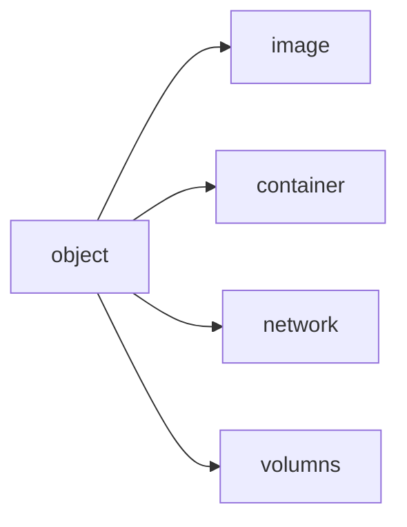

Docker is a platform for running application or program  it solve the problem of configuration when running a machine  to quote "It work on my computer "
docker help with running app in isolated container environment 
you can run multiple different container in a single host 
![[Drawing 2024-12-04 20.56.53.excalidraw|250]]
# benefit of docker  
one or more files missing 
software version mismatch  
different configuration setting 
-> docker solve all of these problem 
![[Drawing 2024-12-04 17.33.07.excalidraw]] 
the containerization aspect of docker allow one machine to run multiple version of a software 

Develop the application + the environment using a container  
Container is used for distribution and testing of application 
help with deployment of to production environment using  container  | [[orchestrated service ]]

## portability 
Container can be run any where on a development work flow 
Portability  allow for easy work load management you can scale up and down   bases on business need  

## running more on the same hardware 
the overall benefit of docker vs virtual machine is that : 
- light weight  fast 
- suitable for high density deployment suitable for  small medium feature 

|                     | Virtual Machine                                                                                       | Container                                                                        |
| ------------------- | ----------------------------------------------------------------------------------------------------- | -------------------------------------------------------------------------------- |
| Kernel              | require a full guest OS                                                                               | share the host machine kernel and OS system this make the container light weight |
| Dedicated Resources | each VM require a fix amount of RAM CPU and disk space even up the machine does not used the resource | a container can dynamically share it host computer OS and resources              |

# Docker client  architecture 
the Docker client talk with the docker daemon,  docker daemon take on most of the work load from  from pulling running  and distributing the docker container  
## communication between client and daemon  
1.  client and daemon can be in the same system 
2. Docker client can communicate with  remote daemon using  Rest API over NNIX 
3. Docker compose  can help application that need multiple deployment and container to  run 
Daemon is helpful for listening for  object image  container  and network volume 
# Docker  client  
is the primary way for communication 
help client communicate with Docker 
when ever you used docker client desktop or GUI  you are using the docker API 
# Docker registry  
the main used  is for storage of docker image 
the default configuration of docker registry  look for the image in docker hub 
you can used the docker pull command and the docker run command in your registry configuration  
docker push can also config registry 

## Docker hub 
while there are many registry docker hub is the best and default registry      docker hub provide a place that you can store your image  ,  for other to either run  or use  
In [Develop with containers](https://docs.docker.com/get-started/introduction/develop-with-containers/), you used the following images that came from Docker Hub, each of which are [Docker Official Images](https://docs.docker.com/trusted-content/official-images/):

- [node](https://hub.docker.com/_/node) - provides a Node environment and is used as the base of your development efforts. This image is also used as the base for the final application image.
- [mysql](https://hub.docker.com/_/mysql) - provides a MySQL database to store the to-do list items
- [phpmyadmin](https://hub.docker.com/_/phpmyadmin) - provides phpMyAdmin, a web-based interface to the MySQL database
- [traefik](https://hub.docker.com/_/traefik) - provides Traefik, a modern HTTP reverse proxy and load balancer that routes requests to the appropriate container based on routing rules
docker hub is a trusted market place having different resources like Docker official image,   docker verified  Publishers  , and  Docker Sponsored Open  Source  Software   to used bases on your image  
thing of docker hub like Github where instead of distributing your code for other developer to used and see you are distributing your images  
# Docker object 

## Image  
image is used for the creation of Docker container   
you can change an Image bases on the current customization 
example is an image bases on Ubutu  but install  Apache webserver  to run  
you can create  your own image or create  an image that other push on registry  

A docker file is need for the creation of Image  the docker file can be written in a simple syntax --> creation of an Image and run it 
when you change a docker file and rebuild the image only the changes will be rebuild 
example : like if you have a config file with running node 14 Mongo DB or other when you rebuild like change to node 15 only the node need to be reinstall 

## Container 
thing of a container as a runnable instance of an image 
you can create start stop delete or move a container 
Container will be an isolated instance from your host machine , other container and your host system  
Container  object are define by the  Image class 
Container instance which are not store  in persistent disappear 

**Service orchestration** is like running all the tasks needed to design, build, and deliver a service from start to finish.

In the past, each part of this process was handled by separate, isolated systems that didn’t talk to each other, and these systems were built for networks that didn’t change much.

Now, with **Network Functions Virtualization (NFV)** and **Software-Defined Networking (SDN)**, things have changed.

- **NFV** lets network operators replace hardware devices (like routers and firewalls) with software that runs on standard computers. This makes networks cheaper, faster, and easier to upgrade.
- **SDN** gives operators more control by allowing them to manage networks through software, making them more flexible and easier to adjust.

Network operators no longer rely on one-purpose machines. Instead, they use software running on general computers and servers, which simplifies the system and speeds up the launch of new services.

# package a docker image to a file 
https://www.reddit.com/r/docker/comments/15p9hlb/where_exactly_is_the_image_file_located_after_you/

asddfsdfdsg