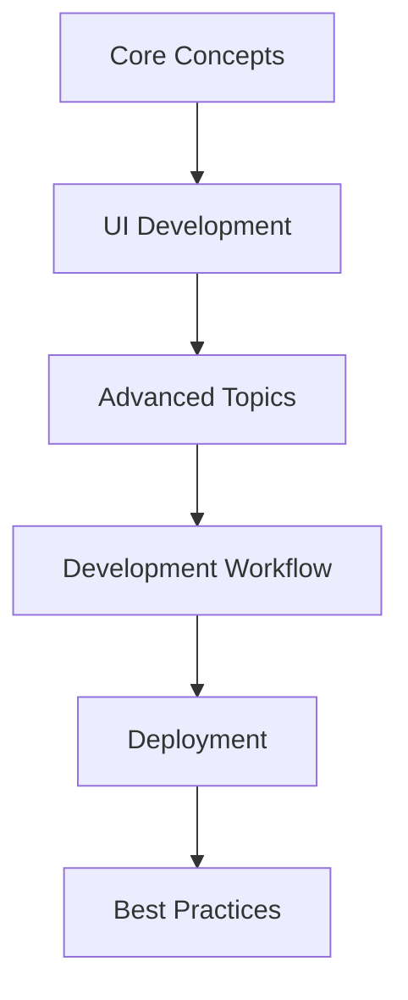

# React Native Learning Framework

## Learning Path Overview



## 1. Core Concepts 📚
- [[01-Introduction/What is React Native]]
- [[01-Introduction/React vs React Native]]
- [[01-Introduction/Development Environment]]
- [[01-Introduction/Project Structure]]

## 2. UI Development 🎨
- [[02-UI/Components/Basic Components]]
- [[02-UI/Components/Custom Components]]
- [[02-UI/Styling/StyleSheet API]]
- [[02-UI/Styling/Responsive Design]]
- [[02-UI/Layout/Flexbox]]
- [[02-UI/Layout/Cross Platform]]

## 3. Advanced Topics 🚀
- [[03-Advanced/Navigation/Stack Navigation]]
- [[03-Advanced/Navigation/Tab Navigation]]
- [[03-Advanced/State/Local State]]
- [[03-Advanced/State/Global State]]
- [[03-Advanced/Native Features/Camera]]
- [[03-Advanced/Native Features/Location]]

## 4. Development Workflow 🛠️
- [[04-Development/Debugging/Tools]]
- [[04-Development/Debugging/Common Issues]]
- [[04-Development/Testing/Unit Tests]]
- [[04-Development/Testing/Integration Tests]]

## 5. Deployment 📱
- [[05-Deployment/iOS/App Store]]
- [[05-Deployment/Android/Play Store]]
- [[05-Deployment/CI-CD/Automation]]

## 6. Best Practices 💡
- [[06-Best Practices/Architecture/Project Structure]]
- [[06-Best Practices/Performance/Optimization]]
- [[06-Best Practices/Security/Guidelines]]

## File Organization

```
React Native/
├── 01-Introduction/
│   ├── What is React Native.md
│   ├── React vs React Native.md
│   └── Development Environment.md
├── 02-UI/
│   ├── Components/
│   ├── Styling/
│   └── Layout/
├── 03-Advanced/
│   ├── Navigation/
│   ├── State/
│   └── Native Features/
├── 04-Development/
│   ├── Debugging/
│   └── Testing/
├── 05-Deployment/
│   ├── iOS/
│   └── Android/
└── 06-Best Practices/
    ├── Architecture/
    ├── Performance/
    └── Security/
```

## Progress Tracking
- [ ] Core Concepts
  - [ ] Introduction
  - [ ] Environment Setup
  - [ ] Basic Concepts
- [ ] UI Development
  - [ ] Components
  - [ ] Styling
  - [ ] Layout
- [ ] Advanced Topics
  - [ ] Navigation
  - [ ] State Management
  - [ ] Native Features
- [ ] Development
  - [ ] Debugging
  - [ ] Testing
- [ ] Deployment
  - [ ] iOS
  - [ ] Android
- [ ] Best Practices
  - [ ] Architecture
  - [ ] Performance
  - [ ] Security

## Resources
- Official Documentation: [React Native Docs](https://reactnative.dev/docs/getting-started)
- Community: [React Native Community](https://github.com/react-native-community)
- Design Guidelines: [Human Interface Guidelines](https://developer.apple.com/design/human-interface-guidelines/) & [Material Design](https://material.io/design)
