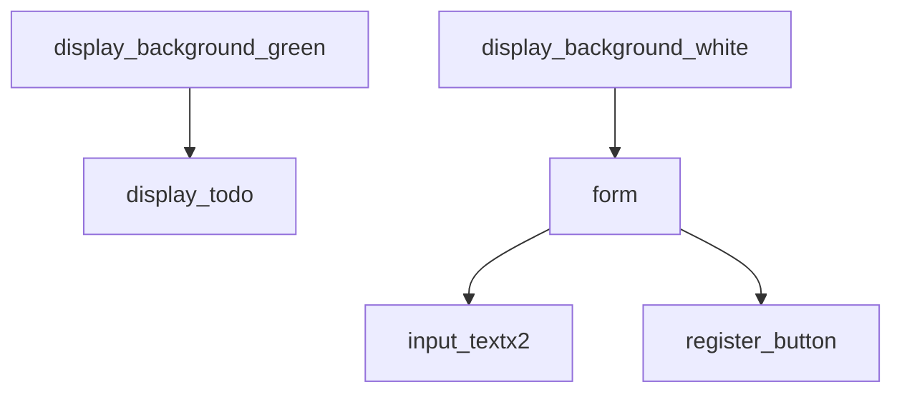
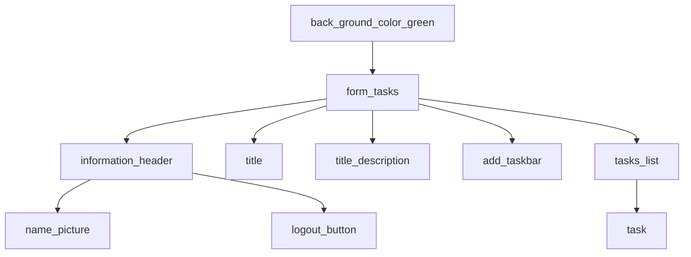

# example project where hook is used 

```
App
├── Header
├── Shop
│   ├── AvailablePlaces (useState [created in AvailablePlaces], useEffect [created in AvailablePlaces])
│   │   └── Places (useState [created in AvailablePlaces], useEffect [created in AvailablePlaces])
│   │       └── Error (useState [created in AvailablePlaces])
│   └── Product
├── Modal (useRef [created in Modal], useEffect [created in Modal])
│   ├── DeleteConfirmation (useEffect [created in DeleteConfirmation])
│   │   └── ProgressBar (useState [created in ProgressBar], useEffect [created in ProgressBar])
│   └── Error
└── UserInput
    └── input-group
        ├── Expected Return (useState [created in UserInput])
        └── Duration (useState [created in UserInput])
```


# login  interface 



# Register interface 


# Home not have tasks list  



## Main home page tree structure 
```
App
├── LoginPage
│   └── FormLogin
├── RegisterPage
│   └── FormRegistor
├── ErrorPage
├── MainPage
│   ├── TasksList
│   │   ├── Task
│   │   ├── Task
│   │   ├── Task
│   │   ├── Task
│   │   ├── Task
│   │   ├── Task
│   │   └── Task
│   ├── InputFlied
│   └── ButtonLogOut (image)
```


