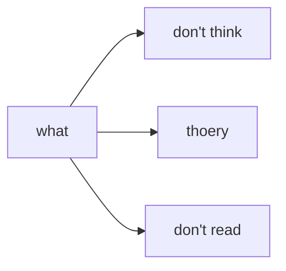
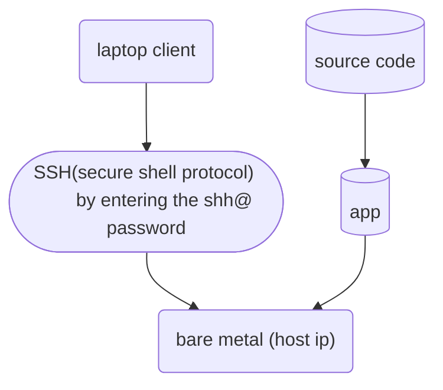

# Infrastructure as code

- this say how to configure and run an application in another computer 
	- this is most used in configurating server computer 
- the laptop client is used to configure the server computer to run the application 

# basic architecture of a computer

![[Drawing 2024-11-21 20.06.42.excalidraw]] 

# why is vagrant needed
imagine this your boss as you to configure a bare metal bases on the configuration by your collage on another computer 
1. give up 
2. used a git version control system to understand the configuration 
vagrant is used to help configure a new bare metal  configure bases on a past computer , there is a one click set up build for this very reason 

![[Drawing 2024-11-21 20.14.31.excalidraw]]
- vagrant up command is a simple command that can be  add on to be able to meet specifit need 

[[vagrant exercise]]

# Shell   1 

# vagrant up/reload 3 
# vagrant  destroy 

# vagrant provision 

# error
##  `vagrant ssh` locks against other `vagrant ssh` tasks
https://github.com/hashicorp/vagrant/issues/4933

## why  EOL prevent the  command bellow it  to run ? 
 config.vm.provision "shell"  , inline: <<-SHELL  

      cat  <<EOL > /etc/nginx/sites-available/default

      server {

        listen 80  ;

        location / {

          proxty_pass  http://localhost:3000  ;

          proxy_http_version  1.1 ;

          proxy_set_header Upgrade  \$http_upgrade ;

          proxy_set_header Connection  "upgrade" ;

          proxy_set_header Host \$host;

          proxy_cache_bypass  \$http_upgrade;

        }

      }

EOL

    SHELL

    config.vm.provision "shell"  , inline: <<-SHELL

      docker pull phuc2411/getting-started-todo-app

    SHELL

  end

## lock process 
https://stackoverflow.com/questions/23306927/vagrant-destroy-not-working

![[Pasted image 20241213201737.png]]

# book on nginx
https://www.f5.com/go/ebook/complete-nginx-cookbook  

