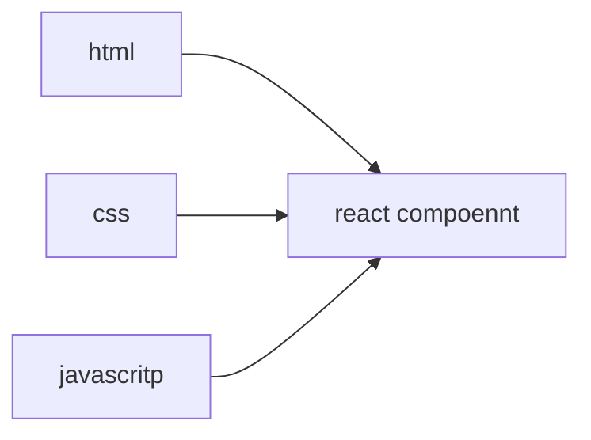
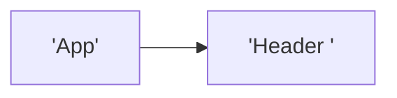
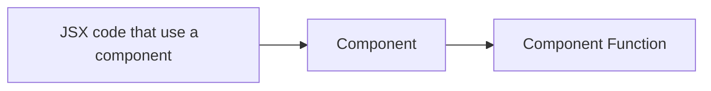

this allow the developer to split complex user interface into more manageable part 

# why is it popular 
you end up with large complex html  file 
change in your code may need to apply to  differernt application make more error 

related code can be store together 
you will split the file into 3 different part 


## working with component 
realtead code keep with each other

# development principle 
there is difffernt component doing different thing 
1. component for user input for multiple developer 
2. working with component is embrace by react 

# Setting up a starting project 


# writting   javascript text in html  file 
the code in the  index  + app js  is not working in the browswer 
the app will transform to code that work if it not in the browser 
react component  is just a javascript function  
## function rule 
1. function  much be an uppercase charcter 
2. return a jsx code like html  

# build project  
the reason  why you see  .jsx file extension is because the build process require it not the browser , the browser can not run the  code but the code get translated due to the build process 
also the reason why there are jsx code inside js is bases on the requirement of the build process 


naming format 
```
[ExerciseNumber]_[Topic]_[Language/Concept]_[OptionalDetail]
```


# How React Handles Components & How It Builds A "Component Tree" [Core Concept]  

when you inspect a file  you just see a normal html  with some js when using react but in the bottem there is a script with the following source  
"/src/index.jsx=`somekind of key` 
the transform  react code you wrote 


when you import or export a function it is a javascript feature  
index.js x  is the main entry point  to show your app component using the reactDom  byreact  using  the function render of an object ReactDom.createRoot(entryPoint)



when you are inspecting a website you can see that the component i when hover will show the root first the App that you force render in the index.js file then when you go deeper into a the app like touch on one of it component you will get header 
this is like a highe archical tree where the deeper you go the  lower you go down the tree 
this is call a coponent tree   
- a hierarchy of component  
- analyzed and rendered by  react step by step  
- the lowest is deely nested component the higest is the root component 

there is two type of component build in component and  custome components 


# outputing dynamic content in JSX  

static content  
content that s hardcoded into the JSX code 


Dynamic content  
logic that produces the actual value is added to JSX 


# reusable component  
rusable component  react  another concept  call prop  being able to pass data in the component then used the data in there 


React allows you to pass data to compnents via a concept called props 

there are   3 differnt tyep of prop value prop accepted  but not limited to  
String value  
number value 
Object value  

```
<CoreConcept

            title="Components"

            description="the core UI building block"

            img

          >
```

when you add a prob like the above you are actually creating an object where the  the pass object prop attribute can be access using   . dot  like  object.title  


# storing a component in another file 
every component can be store in another file and give that file the same name as the name in the file 
you can add a component into it own seperate file 


# children in react  contence 
react will give all custom  component a prop call children  
the children  prop is for every element inside the element opening and closing tag 

# children prop vs attribute props 


| children                                 | attribute prop                                                |
| ---------------------------------------- | ------------------------------------------------------------- |
| single piece  of rendable content        | multiple  smaller piece of content                            |
| passing jsx as code to another component |  extra props instead of querying the tag components for data  |


why does vstudio code open a file on the left side of the same tab some time but some time add a tabs 


# Function in react  
you can add event listener to the element    these element belong to props too    
the element  can support many difffernt type of `on<prop>` 
you much not add a () into the pass prop function  

  // if you add () the code inside it will execute when the code is executed


# passing arrow function  anonymous 
the used of a arrow function is to prevent : 
1. the execution of a function when we need to add in a parameter too that function 
2. help control how the function is going to be call and which argument that is pass 


# how to update ui 
know the intial  content value react in the end     
react will only execute  the function  when  it render the first time  
think of it like this react is calling all the function to build the UI it will not change the UI a second time after execution  
which  is why we used state 


# rule of hooks  


only call hooks on component functions   
only call hooks  in the top level which mean the call cannot be nested 


what is array destructoring in javascript 
![[Drawing 2024-12-16 13.04.25.excalidraw]]
## useState  
data from react when the data change the entried component render agian 


# Deriving and outputting data 

remember that there is not properties name you set in the 
``useState('<set name>) ``set name is the intial value so you should set it to a value that exit in your components 


# rendering content conditionally 
you can used short syntax like && and  |  for conditional rendering in the jsx code 
or you can render it as bases on a  variable 
```
let  tabcontent  = <p><p>
if(true) 
{
tabcontent = <p> hello word  <p>
}
```


# dynamic styling in react  
the class attribute used class name if you want to add to a button 


# list data dynamic  
jsx can list out an array of renderable code  
you can used the map function that receive an array as input 
the function will be executed base on the  num of items in the array  
you will also have a error that say that you need a key prompt 
  


# conclusion 

React is all about component and you learn how to create and used component  much return a value that you can render in react  , 
- config component using prop  , you can add an object as prop 
- object destructoring  or  prop. 
- output dynamic  content  , output between tasks or attribute value  
- between your component closing and opening task s 
- component and prop are important feature  
- you need to listen to even add your own on prop to your custome component  
- if you want to update the UI you much used state  
- special state updating funciton manage and update data  , when you used state the data if change will rerender the UI to match the used state  
- different way to ouput conditional content 
- output dynamic list data  and maps array of data and jsx element  
building user interfaces with components 
using sharing outputing data 
handling user event 
building interactive UI with data 


# error  answer 

success alert

## Good job!

That's the right choice because this statement is false - you ARE ALLOWED to call as many Hook function as needed. And they may (and often will) be positioned directly next to each other.


what is the rule of ## Rules of Hooks ? 
Question 2:

There are two "Rules of Hooks".

Which of the following statements is NOT TRUE according to those rules?

- You must not call React Hooks next to other Hooks.
    
- You must not call React Hooks outside of the component function.
    
- You must not call React Hooks inside of if statements.
    
- You must not call React Hooks inside of nested functions.
What's the purpose of "State" in React apps?
what is the purpost of jsx 
How do "props" work in React?


- You can set props ("custom attributes") on components to automatically output them in the component's JSX code
    
- You can set props ("custom attributes") on components to then extract & use them in the receiving component X
    
- You can set props ("custom attributes") on components which then receive them as automatically provided constants in the function body
    
- You can set props ("custom attributes") on components which can then call a getProps() function to extract the received values

Which of the following four code examples for setting & extracting props would NOT work as intended?

_I.e., which example will NOT output the text "Priority: 5" on the screen._

- 1. <MyComponent priority={5} />
    
      
    
    1. function MyComponent({...props}) {
    2.   return <p>Priority: {props.priority}</p>
    3. }
    
- 1. <MyComponent priority={5} />
    
      
    
    1. function MyComponent(props) {
    2.   return <p>Priority: {props.priority}</p>
    3. }
    
- 1. <MyComponent priority={5} />
    
      
    
    1. function MyComponent({priority}) {
    2.   return <p>Priority: {priority}</p>
    3. }
    
- 1. <MyComponent priority={5} />
    
      
    
    1. function MyComponent(priority) {
    2.   return <p>Priority: {priority}</p>
    3. } 
how should you typically store your component  functions  ?  
what's the purpost of the special  "children" prop ?  
how can you handle user events in react project ?  


  // console.log(selectedButton);

    // event thought we assign the tab with new value it still does not change  

    // the function is executed but the UI is not updated 

```
  

export default function App() {

  const [contentIsVisible, setContentIsVisible] = useState(false);

  

  function handleClick() {

    setContentIsVisible(true);

  }

  return (

    <div>

      {contentIsVisible && <p>Visible</p>}

      <button onClick={handleClick}>Show Content</button>

    </div>

  );

}
```

In JavaScript, the `&&` operator can be used for conditional rendering in JSX. It works because of the way JavaScript handles logical operations. When using `&&`, if the left-hand side of the expression is `true`, the right-hand side will be evaluated and returned. If the left-hand side is `false`, the entire expression will return `false`, and nothing will be rendered.

## error code 
const [productPrice, setProductPrice] = React.useState(0); 
if  I do not add the const in the beginning it will not show the UI 


