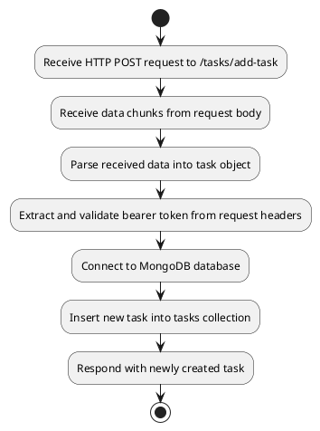

### Tree-like Structure

#### 1. [`handleAddTask`](command:_github.copilot.openSymbolFromReferences?%5B%22%22%2C%5B%7B%22uri%22%3A%7B%22scheme%22%3A%22file%22%2C%22authority%22%3A%22%22%2C%22path%22%3A%22%2FD%3A%2FLearning%20programming%20language%20valut%20%2B%20project%2Fhomework%2FtoDoApp%2FbackEndTodoApp%2Fserver%2Fcontrollers%2Ftasks%2Findex.js%22%2C%22query%22%3A%22%22%2C%22fragment%22%3A%22%22%7D%2C%22pos%22%3A%7B%22line%22%3A250%2C%22character%22%3A15%7D%7D%2C%7B%22uri%22%3A%7B%22scheme%22%3A%22file%22%2C%22authority%22%3A%22%22%2C%22path%22%3A%22%2FD%3A%2FLearning%20programming%20language%20valut%20%2B%20project%2Fhomework%2FtoDoApp%2FbackEndTodoApp%2Fserver%2Fcontrollers%2Ftasks%2Findex.js%22%2C%22query%22%3A%22%22%2C%22fragment%22%3A%22%22%7D%2C%22pos%22%3A%7B%22line%22%3A250%2C%22character%22%3A15%7D%7D%5D%2C%22b61de79a-c8c3-48db-994d-3ee07fcb888e%22%5D "Go to definition")
- **Trigger**: HTTP POST request to `/tasks/add-task`
- **Steps**:
  - Receive data chunks from the request body.
  - Parse the received data into a task object.
  - Extract and validate the bearer token from the request headers.
  - Connect to the MongoDB database.
  - Insert the new task into the [`tasks`](command:_github.copilot.openSymbolFromReferences?%5B%22%22%2C%5B%7B%22uri%22%3A%7B%22scheme%22%3A%22file%22%2C%22authority%22%3A%22%22%2C%22path%22%3A%22%2Fd%3A%2FLearning%20programming%20language%20valut%20%2B%20project%2Fhomework%2FtoDoApp%2FbackEndTodoApp%2Fserver%2Frouter%2Froutes.js%22%2C%22query%22%3A%22%22%2C%22fragment%22%3A%22%22%7D%2C%22pos%22%3A%7B%22line%22%3A1%2C%22character%22%3A2%7D%7D%2C%7B%22uri%22%3A%7B%22scheme%22%3A%22file%22%2C%22authority%22%3A%22%22%2C%22path%22%3A%22%2FD%3A%2FLearning%20programming%20language%20valut%20%2B%20project%2Fhomework%2FtoDoApp%2FbackEndTodoApp%2Fserver%2Fcontrollers%2Ftasks%2Findex.js%22%2C%22query%22%3A%22%22%2C%22fragment%22%3A%22%22%7D%2C%22pos%22%3A%7B%22line%22%3A264%2C%22character%22%3A12%7D%7D%5D%2C%22b61de79a-c8c3-48db-994d-3ee07fcb888e%22%5D "Go to definition") collection.
  - Respond with the newly created task.

#### 2. [`handleGetTasksById`](command:_github.copilot.openSymbolFromReferences?%5B%22%22%2C%5B%7B%22uri%22%3A%7B%22scheme%22%3A%22file%22%2C%22authority%22%3A%22%22%2C%22path%22%3A%22%2FD%3A%2FLearning%20programming%20language%20valut%20%2B%20project%2Fhomework%2FtoDoApp%2FbackEndTodoApp%2Fserver%2Fcontrollers%2Ftasks%2Findex.js%22%2C%22query%22%3A%22%22%2C%22fragment%22%3A%22%22%7D%2C%22pos%22%3A%7B%22line%22%3A292%2C%22character%22%3A15%7D%7D%5D%2C%22b61de79a-c8c3-48db-994d-3ee07fcb888e%22%5D "Go to definition")
- **Trigger**: HTTP GET request to `/tasks/get-task`
- **Steps**:
  - Extract and validate the bearer token from the request headers.
  - Connect to the MongoDB database.
  - Retrieve tasks associated with the user from the [`tasks`](command:_github.copilot.openSymbolFromReferences?%5B%22%22%2C%5B%7B%22uri%22%3A%7B%22scheme%22%3A%22file%22%2C%22authority%22%3A%22%22%2C%22path%22%3A%22%2Fd%3A%2FLearning%20programming%20language%20valut%20%2B%20project%2Fhomework%2FtoDoApp%2FbackEndTodoApp%2Fserver%2Frouter%2Froutes.js%22%2C%22query%22%3A%22%22%2C%22fragment%22%3A%22%22%7D%2C%22pos%22%3A%7B%22line%22%3A1%2C%22character%22%3A2%7D%7D%2C%7B%22uri%22%3A%7B%22scheme%22%3A%22file%22%2C%22authority%22%3A%22%22%2C%22path%22%3A%22%2FD%3A%2FLearning%20programming%20language%20valut%20%2B%20project%2Fhomework%2FtoDoApp%2FbackEndTodoApp%2Fserver%2Fcontrollers%2Ftasks%2Findex.js%22%2C%22query%22%3A%22%22%2C%22fragment%22%3A%22%22%7D%2C%22pos%22%3A%7B%22line%22%3A264%2C%22character%22%3A12%7D%7D%5D%2C%22b61de79a-c8c3-48db-994d-3ee07fcb888e%22%5D "Go to definition") collection.
  - Respond with the retrieved tasks.

#### 3. [`handleUpdateTask`](command:_github.copilot.openSymbolFromReferences?%5B%22%22%2C%5B%7B%22uri%22%3A%7B%22scheme%22%3A%22file%22%2C%22authority%22%3A%22%22%2C%22path%22%3A%22%2FD%3A%2FLearning%20programming%20language%20valut%20%2B%20project%2Fhomework%2FtoDoApp%2FbackEndTodoApp%2Fserver%2Fcontrollers%2Ftasks%2Findex.js%22%2C%22query%22%3A%22%22%2C%22fragment%22%3A%22%22%7D%2C%22pos%22%3A%7B%22line%22%3A321%2C%22character%22%3A15%7D%7D%5D%2C%22b61de79a-c8c3-48db-994d-3ee07fcb888e%22%5D "Go to definition")
- **Trigger**: HTTP PUT request to `/tasks/update-task`
- **Steps**:
  - Receive data chunks from the request body.
  - Parse the received data into an updated task object.
  - Extract and validate the bearer token from the request headers.
  - Connect to the MongoDB database.
  - Update the specified task in the [`tasks`](command:_github.copilot.openSymbolFromReferences?%5B%22%22%2C%5B%7B%22uri%22%3A%7B%22scheme%22%3A%22file%22%2C%22authority%22%3A%22%22%2C%22path%22%3A%22%2Fd%3A%2FLearning%20programming%20language%20valut%20%2B%20project%2Fhomework%2FtoDoApp%2FbackEndTodoApp%2Fserver%2Frouter%2Froutes.js%22%2C%22query%22%3A%22%22%2C%22fragment%22%3A%22%22%7D%2C%22pos%22%3A%7B%22line%22%3A1%2C%22character%22%3A2%7D%7D%2C%7B%22uri%22%3A%7B%22scheme%22%3A%22file%22%2C%22authority%22%3A%22%22%2C%22path%22%3A%22%2FD%3A%2FLearning%20programming%20language%20valut%20%2B%20project%2Fhomework%2FtoDoApp%2FbackEndTodoApp%2Fserver%2Fcontrollers%2Ftasks%2Findex.js%22%2C%22query%22%3A%22%22%2C%22fragment%22%3A%22%22%7D%2C%22pos%22%3A%7B%22line%22%3A264%2C%22character%22%3A12%7D%7D%5D%2C%22b61de79a-c8c3-48db-994d-3ee07fcb888e%22%5D "Go to definition") collection.
  - Respond with the updated task.

#### 4. [`handleDeleteTaskById`](command:_github.copilot.openSymbolFromReferences?%5B%22%22%2C%5B%7B%22uri%22%3A%7B%22scheme%22%3A%22file%22%2C%22authority%22%3A%22%22%2C%22path%22%3A%22%2FD%3A%2FLearning%20programming%20language%20valut%20%2B%20project%2Fhomework%2FtoDoApp%2FbackEndTodoApp%2Fserver%2Fcontrollers%2Ftasks%2Findex.js%22%2C%22query%22%3A%22%22%2C%22fragment%22%3A%22%22%7D%2C%22pos%22%3A%7B%22line%22%3A367%2C%22character%22%3A15%7D%7D%5D%2C%22b61de79a-c8c3-48db-994d-3ee07fcb888e%22%5D "Go to definition")
- **Trigger**: HTTP DELETE request to `/tasks/delete-task`
- **Steps**:
  - Receive data chunks from the request body.
  - Parse the received data to extract the task ID.
  - Extract and validate the bearer token from the request headers.
  - Connect to the MongoDB database.
  - Delete the specified task from the [`tasks`](command:_github.copilot.openSymbolFromReferences?%5B%22%22%2C%5B%7B%22uri%22%3A%7B%22scheme%22%3A%22file%22%2C%22authority%22%3A%22%22%2C%22path%22%3A%22%2Fd%3A%2FLearning%20programming%20language%20valut%20%2B%20project%2Fhomework%2FtoDoApp%2FbackEndTodoApp%2Fserver%2Frouter%2Froutes.js%22%2C%22query%22%3A%22%22%2C%22fragment%22%3A%22%22%7D%2C%22pos%22%3A%7B%22line%22%3A1%2C%22character%22%3A2%7D%7D%2C%7B%22uri%22%3A%7B%22scheme%22%3A%22file%22%2C%22authority%22%3A%22%22%2C%22path%22%3A%22%2FD%3A%2FLearning%20programming%20language%20valut%20%2B%20project%2Fhomework%2FtoDoApp%2FbackEndTodoApp%2Fserver%2Fcontrollers%2Ftasks%2Findex.js%22%2C%22query%22%3A%22%22%2C%22fragment%22%3A%22%22%7D%2C%22pos%22%3A%7B%22line%22%3A264%2C%22character%22%3A12%7D%7D%5D%2C%22b61de79a-c8c3-48db-994d-3ee07fcb888e%22%5D "Go to definition") collection.
  - Respond with a confirmation message.

### Detailed Steps for Each Function

#### [`handleAddTask`](command:_github.copilot.openSymbolFromReferences?%5B%22%22%2C%5B%7B%22uri%22%3A%7B%22scheme%22%3A%22file%22%2C%22authority%22%3A%22%22%2C%22path%22%3A%22%2FD%3A%2FLearning%20programming%20language%20valut%20%2B%20project%2Fhomework%2FtoDoApp%2FbackEndTodoApp%2Fserver%2Fcontrollers%2Ftasks%2Findex.js%22%2C%22query%22%3A%22%22%2C%22fragment%22%3A%22%22%7D%2C%22pos%22%3A%7B%22line%22%3A250%2C%22character%22%3A15%7D%7D%2C%7B%22uri%22%3A%7B%22scheme%22%3A%22file%22%2C%22authority%22%3A%22%22%2C%22path%22%3A%22%2FD%3A%2FLearning%20programming%20language%20valut%20%2B%20project%2Fhomework%2FtoDoApp%2FbackEndTodoApp%2Fserver%2Fcontrollers%2Ftasks%2Findex.js%22%2C%22query%22%3A%22%22%2C%22fragment%22%3A%22%22%7D%2C%22pos%22%3A%7B%22line%22%3A250%2C%22character%22%3A15%7D%7D%5D%2C%22b61de79a-c8c3-48db-994d-3ee07fcb888e%22%5D "Go to definition")
1. **Receive Data**:
   - [`request.on('data', chunk => { chunks.push(chunk); });`](command:_github.copilot.openSymbolFromReferences?%5B%22%22%2C%5B%7B%22uri%22%3A%7B%22scheme%22%3A%22file%22%2C%22authority%22%3A%22%22%2C%22path%22%3A%22%2FD%3A%2FLearning%20programming%20language%20valut%20%2B%20project%2Fhomework%2FtoDoApp%2FbackEndTodoApp%2Fserver%2Fcontrollers%2Ftasks%2Findex.js%22%2C%22query%22%3A%22%22%2C%22fragment%22%3A%22%22%7D%2C%22pos%22%3A%7B%22line%22%3A250%2C%22character%22%3A29%7D%7D%2C%7B%22uri%22%3A%7B%22scheme%22%3A%22file%22%2C%22authority%22%3A%22%22%2C%22path%22%3A%22%2FD%3A%2FLearning%20programming%20language%20valut%20%2B%20project%2Fhomework%2FtoDoApp%2FbackEndTodoApp%2Fserver%2Frouter%2Fmethods.js%22%2C%22query%22%3A%22%22%2C%22fragment%22%3A%22%22%7D%2C%22pos%22%3A%7B%22line%22%3A3%2C%22character%22%3A17%7D%7D%2C%7B%22uri%22%3A%7B%22scheme%22%3A%22file%22%2C%22authority%22%3A%22%22%2C%22path%22%3A%22%2FD%3A%2FLearning%20programming%20language%20valut%20%2B%20project%2Fhomework%2FtoDoApp%2FbackEndTodoApp%2Fserver%2Fcontrollers%2Ftasks%2Findex.js%22%2C%22query%22%3A%22%22%2C%22fragment%22%3A%22%22%7D%2C%22pos%22%3A%7B%22line%22%3A250%2C%22character%22%3A29%7D%7D%5D%2C%22b61de79a-c8c3-48db-994d-3ee07fcb888e%22%5D "Go to definition")
2. **Parse Data**:
   - [`const taskData = JSON.parse(Buffer.concat(chunks).toString());`](command:_github.copilot.openSymbolFromReferences?%5B%22%22%2C%5B%7B%22uri%22%3A%7B%22scheme%22%3A%22file%22%2C%22authority%22%3A%22%22%2C%22path%22%3A%22%2FD%3A%2FLearning%20programming%20language%20valut%20%2B%20project%2Fhomework%2FtoDoApp%2FbackEndTodoApp%2Fserver%2Fcontrollers%2Ftasks%2Findex.js%22%2C%22query%22%3A%22%22%2C%22fragment%22%3A%22%22%7D%2C%22pos%22%3A%7B%22line%22%3A258%2C%22character%22%3A12%7D%7D%2C%7B%22uri%22%3A%7B%22scheme%22%3A%22file%22%2C%22authority%22%3A%22%22%2C%22path%22%3A%22%2FD%3A%2FLearning%20programming%20language%20valut%20%2B%20project%2Fhomework%2FtoDoApp%2FbackEndTodoApp%2Fserver%2Fcontrollers%2Ftasks%2Findex.js%22%2C%22query%22%3A%22%22%2C%22fragment%22%3A%22%22%7D%2C%22pos%22%3A%7B%22line%22%3A258%2C%22character%22%3A12%7D%7D%5D%2C%22b61de79a-c8c3-48db-994d-3ee07fcb888e%22%5D "Go to definition")
3. **Extract Token**:
   - [`const bearerToken = request.headers.authorization.split(" ")[1];`](command:_github.copilot.openSymbolFromReferences?%5B%22%22%2C%5B%7B%22uri%22%3A%7B%22scheme%22%3A%22file%22%2C%22authority%22%3A%22%22%2C%22path%22%3A%22%2FD%3A%2FLearning%20programming%20language%20valut%20%2B%20project%2Fhomework%2FtoDoApp%2FbackEndTodoApp%2Fserver%2Fcontrollers%2Ftasks%2Findex.js%22%2C%22query%22%3A%22%22%2C%22fragment%22%3A%22%22%7D%2C%22pos%22%3A%7B%22line%22%3A259%2C%22character%22%3A12%7D%7D%2C%7B%22uri%22%3A%7B%22scheme%22%3A%22file%22%2C%22authority%22%3A%22%22%2C%22path%22%3A%22%2FD%3A%2FLearning%20programming%20language%20valut%20%2B%20project%2Fhomework%2FtoDoApp%2FbackEndTodoApp%2Fserver%2Fcontrollers%2Ftasks%2Findex.js%22%2C%22query%22%3A%22%22%2C%22fragment%22%3A%22%22%7D%2C%22pos%22%3A%7B%22line%22%3A259%2C%22character%22%3A12%7D%7D%5D%2C%22b61de79a-c8c3-48db-994d-3ee07fcb888e%22%5D "Go to definition")
4. **Connect to DB**:
   - [`const db = await connectToDatabase();`](command:_github.copilot.openSymbolFromReferences?%5B%22%22%2C%5B%7B%22uri%22%3A%7B%22scheme%22%3A%22file%22%2C%22authority%22%3A%22%22%2C%22path%22%3A%22%2FD%3A%2FLearning%20programming%20language%20valut%20%2B%20project%2Fhomework%2FtoDoApp%2FbackEndTodoApp%2Fserver%2Fcontrollers%2Ftasks%2Findex.js%22%2C%22query%22%3A%22%22%2C%22fragment%22%3A%22%22%7D%2C%22pos%22%3A%7B%22line%22%3A242%2C%22character%22%3A18%7D%7D%2C%7B%22uri%22%3A%7B%22scheme%22%3A%22file%22%2C%22authority%22%3A%22%22%2C%22path%22%3A%22%2FD%3A%2FLearning%20programming%20language%20valut%20%2B%20project%2Fhomework%2FtoDoApp%2FbackEndTodoApp%2Fserver%2Fcontrollers%2Ftasks%2Findex.js%22%2C%22query%22%3A%22%22%2C%22fragment%22%3A%22%22%7D%2C%22pos%22%3A%7B%22line%22%3A242%2C%22character%22%3A18%7D%7D%5D%2C%22b61de79a-c8c3-48db-994d-3ee07fcb888e%22%5D "Go to definition")
5. **Insert Task**:
   - [`await db.collection('tasks').insertOne(taskData);`](command:_github.copilot.openSymbolFromReferences?%5B%22%22%2C%5B%7B%22uri%22%3A%7B%22scheme%22%3A%22file%22%2C%22authority%22%3A%22%22%2C%22path%22%3A%22%2FD%3A%2FLearning%20programming%20language%20valut%20%2B%20project%2Fhomework%2FtoDoApp%2FbackEndTodoApp%2Fserver%2Fcontrollers%2Ftasks%2Findex.js%22%2C%22query%22%3A%22%22%2C%22fragment%22%3A%22%22%7D%2C%22pos%22%3A%7B%22line%22%3A242%2C%22character%22%3A18%7D%7D%2C%7B%22uri%22%3A%7B%22scheme%22%3A%22file%22%2C%22authority%22%3A%22%22%2C%22path%22%3A%22%2FD%3A%2FLearning%20programming%20language%20valut%20%2B%20project%2Fhomework%2FtoDoApp%2FbackEndTodoApp%2Fserver%2Fcontrollers%2Ftasks%2Findex.js%22%2C%22query%22%3A%22%22%2C%22fragment%22%3A%22%22%7D%2C%22pos%22%3A%7B%22line%22%3A242%2C%22character%22%3A18%7D%7D%5D%2C%22b61de79a-c8c3-48db-994d-3ee07fcb888e%22%5D "Go to definition")
6. **Respond**:
   - [`response.end(JSON.stringify(taskData));`](command:_github.copilot.openSymbolFromReferences?%5B%22%22%2C%5B%7B%22uri%22%3A%7B%22scheme%22%3A%22file%22%2C%22authority%22%3A%22%22%2C%22path%22%3A%22%2FD%3A%2FLearning%20programming%20language%20valut%20%2B%20project%2Fhomework%2FtoDoApp%2FbackEndTodoApp%2Fserver%2Fcontrollers%2Ftasks%2Findex.js%22%2C%22query%22%3A%22%22%2C%22fragment%22%3A%22%22%7D%2C%22pos%22%3A%7B%22line%22%3A250%2C%22character%22%3A38%7D%7D%2C%7B%22uri%22%3A%7B%22scheme%22%3A%22file%22%2C%22authority%22%3A%22%22%2C%22path%22%3A%22%2FD%3A%2FLearning%20programming%20language%20valut%20%2B%20project%2Fhomework%2FtoDoApp%2FbackEndTodoApp%2Fserver%2Frouter%2Fmethods.js%22%2C%22query%22%3A%22%22%2C%22fragment%22%3A%22%22%7D%2C%22pos%22%3A%7B%22line%22%3A3%2C%22character%22%3A26%7D%7D%2C%7B%22uri%22%3A%7B%22scheme%22%3A%22file%22%2C%22authority%22%3A%22%22%2C%22path%22%3A%22%2FD%3A%2FLearning%20programming%20language%20valut%20%2B%20project%2Fhomework%2FtoDoApp%2FbackEndTodoApp%2Fserver%2Fcontrollers%2Ftasks%2Findex.js%22%2C%22query%22%3A%22%22%2C%22fragment%22%3A%22%22%7D%2C%22pos%22%3A%7B%22line%22%3A250%2C%22character%22%3A38%7D%7D%5D%2C%22b61de79a-c8c3-48db-994d-3ee07fcb888e%22%5D "Go to definition")

#### [`handleGetTasksById`](command:_github.copilot.openSymbolFromReferences?%5B%22%22%2C%5B%7B%22uri%22%3A%7B%22scheme%22%3A%22file%22%2C%22authority%22%3A%22%22%2C%22path%22%3A%22%2FD%3A%2FLearning%20programming%20language%20valut%20%2B%20project%2Fhomework%2FtoDoApp%2FbackEndTodoApp%2Fserver%2Fcontrollers%2Ftasks%2Findex.js%22%2C%22query%22%3A%22%22%2C%22fragment%22%3A%22%22%7D%2C%22pos%22%3A%7B%22line%22%3A292%2C%22character%22%3A15%7D%7D%5D%2C%22b61de79a-c8c3-48db-994d-3ee07fcb888e%22%5D "Go to definition")
1. **Extract Token**:
   - [`const bearerToken = request.headers.authorization.split(" ")[1];`](command:_github.copilot.openSymbolFromReferences?%5B%22%22%2C%5B%7B%22uri%22%3A%7B%22scheme%22%3A%22file%22%2C%22authority%22%3A%22%22%2C%22path%22%3A%22%2FD%3A%2FLearning%20programming%20language%20valut%20%2B%20project%2Fhomework%2FtoDoApp%2FbackEndTodoApp%2Fserver%2Fcontrollers%2Ftasks%2Findex.js%22%2C%22query%22%3A%22%22%2C%22fragment%22%3A%22%22%7D%2C%22pos%22%3A%7B%22line%22%3A259%2C%22character%22%3A12%7D%7D%2C%7B%22uri%22%3A%7B%22scheme%22%3A%22file%22%2C%22authority%22%3A%22%22%2C%22path%22%3A%22%2FD%3A%2FLearning%20programming%20language%20valut%20%2B%20project%2Fhomework%2FtoDoApp%2FbackEndTodoApp%2Fserver%2Fcontrollers%2Ftasks%2Findex.js%22%2C%22query%22%3A%22%22%2C%22fragment%22%3A%22%22%7D%2C%22pos%22%3A%7B%22line%22%3A259%2C%22character%22%3A12%7D%7D%5D%2C%22b61de79a-c8c3-48db-994d-3ee07fcb888e%22%5D "Go to definition")
2. **Connect to DB**:
   - [`const db = await connectToDatabase();`](command:_github.copilot.openSymbolFromReferences?%5B%22%22%2C%5B%7B%22uri%22%3A%7B%22scheme%22%3A%22file%22%2C%22authority%22%3A%22%22%2C%22path%22%3A%22%2FD%3A%2FLearning%20programming%20language%20valut%20%2B%20project%2Fhomework%2FtoDoApp%2FbackEndTodoApp%2Fserver%2Fcontrollers%2Ftasks%2Findex.js%22%2C%22query%22%3A%22%22%2C%22fragment%22%3A%22%22%7D%2C%22pos%22%3A%7B%22line%22%3A242%2C%22character%22%3A18%7D%7D%2C%7B%22uri%22%3A%7B%22scheme%22%3A%22file%22%2C%22authority%22%3A%22%22%2C%22path%22%3A%22%2FD%3A%2FLearning%20programming%20language%20valut%20%2B%20project%2Fhomework%2FtoDoApp%2FbackEndTodoApp%2Fserver%2Fcontrollers%2Ftasks%2Findex.js%22%2C%22query%22%3A%22%22%2C%22fragment%22%3A%22%22%7D%2C%22pos%22%3A%7B%22line%22%3A242%2C%22character%22%3A18%7D%7D%5D%2C%22b61de79a-c8c3-48db-994d-3ee07fcb888e%22%5D "Go to definition")
3. **Retrieve Tasks**:
   - [`const tasks = await db.collection('tasks').find({ userId: userId }).toArray();`](command:_github.copilot.openSymbolFromReferences?%5B%22%22%2C%5B%7B%22uri%22%3A%7B%22scheme%22%3A%22file%22%2C%22authority%22%3A%22%22%2C%22path%22%3A%22%2Fd%3A%2FLearning%20programming%20language%20valut%20%2B%20project%2Fhomework%2FtoDoApp%2FbackEndTodoApp%2Fserver%2Frouter%2Froutes.js%22%2C%22query%22%3A%22%22%2C%22fragment%22%3A%22%22%7D%2C%22pos%22%3A%7B%22line%22%3A1%2C%22character%22%3A2%7D%7D%2C%7B%22uri%22%3A%7B%22scheme%22%3A%22file%22%2C%22authority%22%3A%22%22%2C%22path%22%3A%22%2FD%3A%2FLearning%20programming%20language%20valut%20%2B%20project%2Fhomework%2FtoDoApp%2FbackEndTodoApp%2Fserver%2Fcontrollers%2Ftasks%2Findex.js%22%2C%22query%22%3A%22%22%2C%22fragment%22%3A%22%22%7D%2C%22pos%22%3A%7B%22line%22%3A264%2C%22character%22%3A12%7D%7D%5D%2C%22b61de79a-c8c3-48db-994d-3ee07fcb888e%22%5D "Go to definition")
4. **Respond**:
   - [`response.end(JSON.stringify(tasks));`](command:_github.copilot.openSymbolFromReferences?%5B%22%22%2C%5B%7B%22uri%22%3A%7B%22scheme%22%3A%22file%22%2C%22authority%22%3A%22%22%2C%22path%22%3A%22%2FD%3A%2FLearning%20programming%20language%20valut%20%2B%20project%2Fhomework%2FtoDoApp%2FbackEndTodoApp%2Fserver%2Fcontrollers%2Ftasks%2Findex.js%22%2C%22query%22%3A%22%22%2C%22fragment%22%3A%22%22%7D%2C%22pos%22%3A%7B%22line%22%3A250%2C%22character%22%3A38%7D%7D%2C%7B%22uri%22%3A%7B%22scheme%22%3A%22file%22%2C%22authority%22%3A%22%22%2C%22path%22%3A%22%2FD%3A%2FLearning%20programming%20language%20valut%20%2B%20project%2Fhomework%2FtoDoApp%2FbackEndTodoApp%2Fserver%2Frouter%2Fmethods.js%22%2C%22query%22%3A%22%22%2C%22fragment%22%3A%22%22%7D%2C%22pos%22%3A%7B%22line%22%3A3%2C%22character%22%3A26%7D%7D%2C%7B%22uri%22%3A%7B%22scheme%22%3A%22file%22%2C%22authority%22%3A%22%22%2C%22path%22%3A%22%2FD%3A%2FLearning%20programming%20language%20valut%20%2B%20project%2Fhomework%2FtoDoApp%2FbackEndTodoApp%2Fserver%2Fcontrollers%2Ftasks%2Findex.js%22%2C%22query%22%3A%22%22%2C%22fragment%22%3A%22%22%7D%2C%22pos%22%3A%7B%22line%22%3A250%2C%22character%22%3A38%7D%7D%5D%2C%22b61de79a-c8c3-48db-994d-3ee07fcb888e%22%5D "Go to definition")

#### [`handleUpdateTask`](command:_github.copilot.openSymbolFromReferences?%5B%22%22%2C%5B%7B%22uri%22%3A%7B%22scheme%22%3A%22file%22%2C%22authority%22%3A%22%22%2C%22path%22%3A%22%2FD%3A%2FLearning%20programming%20language%20valut%20%2B%20project%2Fhomework%2FtoDoApp%2FbackEndTodoApp%2Fserver%2Fcontrollers%2Ftasks%2Findex.js%22%2C%22query%22%3A%22%22%2C%22fragment%22%3A%22%22%7D%2C%22pos%22%3A%7B%22line%22%3A321%2C%22character%22%3A15%7D%7D%5D%2C%22b61de79a-c8c3-48db-994d-3ee07fcb888e%22%5D "Go to definition")
1. **Receive Data**:
   - [`request.on('data', chunk => { chunks.push(chunk); });`](command:_github.copilot.openSymbolFromReferences?%5B%22%22%2C%5B%7B%22uri%22%3A%7B%22scheme%22%3A%22file%22%2C%22authority%22%3A%22%22%2C%22path%22%3A%22%2FD%3A%2FLearning%20programming%20language%20valut%20%2B%20project%2Fhomework%2FtoDoApp%2FbackEndTodoApp%2Fserver%2Fcontrollers%2Ftasks%2Findex.js%22%2C%22query%22%3A%22%22%2C%22fragment%22%3A%22%22%7D%2C%22pos%22%3A%7B%22line%22%3A250%2C%22character%22%3A29%7D%7D%2C%7B%22uri%22%3A%7B%22scheme%22%3A%22file%22%2C%22authority%22%3A%22%22%2C%22path%22%3A%22%2FD%3A%2FLearning%20programming%20language%20valut%20%2B%20project%2Fhomework%2FtoDoApp%2FbackEndTodoApp%2Fserver%2Frouter%2Fmethods.js%22%2C%22query%22%3A%22%22%2C%22fragment%22%3A%22%22%7D%2C%22pos%22%3A%7B%22line%22%3A3%2C%22character%22%3A17%7D%7D%2C%7B%22uri%22%3A%7B%22scheme%22%3A%22file%22%2C%22authority%22%3A%22%22%2C%22path%22%3A%22%2FD%3A%2FLearning%20programming%20language%20valut%20%2B%20project%2Fhomework%2FtoDoApp%2FbackEndTodoApp%2Fserver%2Fcontrollers%2Ftasks%2Findex.js%22%2C%22query%22%3A%22%22%2C%22fragment%22%3A%22%22%7D%2C%22pos%22%3A%7B%22line%22%3A250%2C%22character%22%3A29%7D%7D%5D%2C%22b61de79a-c8c3-48db-994d-3ee07fcb888e%22%5D "Go to definition")
2. **Parse Data**:
   - `const updatedTask = JSON.parse(Buffer.concat(chunks).toString());`
3. **Extract Token**:
   - [`const bearerToken = request.headers.authorization.split(" ")[1];`](command:_github.copilot.openSymbolFromReferences?%5B%22%22%2C%5B%7B%22uri%22%3A%7B%22scheme%22%3A%22file%22%2C%22authority%22%3A%22%22%2C%22path%22%3A%22%2FD%3A%2FLearning%20programming%20language%20valut%20%2B%20project%2Fhomework%2FtoDoApp%2FbackEndTodoApp%2Fserver%2Fcontrollers%2Ftasks%2Findex.js%22%2C%22query%22%3A%22%22%2C%22fragment%22%3A%22%22%7D%2C%22pos%22%3A%7B%22line%22%3A259%2C%22character%22%3A12%7D%7D%2C%7B%22uri%22%3A%7B%22scheme%22%3A%22file%22%2C%22authority%22%3A%22%22%2C%22path%22%3A%22%2FD%3A%2FLearning%20programming%20language%20valut%20%2B%20project%2Fhomework%2FtoDoApp%2FbackEndTodoApp%2Fserver%2Fcontrollers%2Ftasks%2Findex.js%22%2C%22query%22%3A%22%22%2C%22fragment%22%3A%22%22%7D%2C%22pos%22%3A%7B%22line%22%3A259%2C%22character%22%3A12%7D%7D%5D%2C%22b61de79a-c8c3-48db-994d-3ee07fcb888e%22%5D "Go to definition")
4. **Connect to DB**:
   - [`const db = await connectToDatabase();`](command:_github.copilot.openSymbolFromReferences?%5B%22%22%2C%5B%7B%22uri%22%3A%7B%22scheme%22%3A%22file%22%2C%22authority%22%3A%22%22%2C%22path%22%3A%22%2FD%3A%2FLearning%20programming%20language%20valut%20%2B%20project%2Fhomework%2FtoDoApp%2FbackEndTodoApp%2Fserver%2Fcontrollers%2Ftasks%2Findex.js%22%2C%22query%22%3A%22%22%2C%22fragment%22%3A%22%22%7D%2C%22pos%22%3A%7B%22line%22%3A242%2C%22character%22%3A18%7D%7D%2C%7B%22uri%22%3A%7B%22scheme%22%3A%22file%22%2C%22authority%22%3A%22%22%2C%22path%22%3A%22%2FD%3A%2FLearning%20programming%20language%20valut%20%2B%20project%2Fhomework%2FtoDoApp%2FbackEndTodoApp%2Fserver%2Fcontrollers%2Ftasks%2Findex.js%22%2C%22query%22%3A%22%22%2C%22fragment%22%3A%22%22%7D%2C%22pos%22%3A%7B%22line%22%3A242%2C%22character%22%3A18%7D%7D%5D%2C%22b61de79a-c8c3-48db-994d-3ee07fcb888e%22%5D "Go to definition")
5. **Update Task**:
   - [`await db.collection('tasks').updateOne({ _id: ObjectId(updatedTask.id) }, { $set: updatedTask });`](command:_github.copilot.openSymbolFromReferences?%5B%22%22%2C%5B%7B%22uri%22%3A%7B%22scheme%22%3A%22file%22%2C%22authority%22%3A%22%22%2C%22path%22%3A%22%2FD%3A%2FLearning%20programming%20language%20valut%20%2B%20project%2Fhomework%2FtoDoApp%2FbackEndTodoApp%2Fserver%2Fcontrollers%2Ftasks%2Findex.js%22%2C%22query%22%3A%22%22%2C%22fragment%22%3A%22%22%7D%2C%22pos%22%3A%7B%22line%22%3A242%2C%22character%22%3A18%7D%7D%2C%7B%22uri%22%3A%7B%22scheme%22%3A%22file%22%2C%22authority%22%3A%22%22%2C%22path%22%3A%22%2FD%3A%2FLearning%20programming%20language%20valut%20%2B%20project%2Fhomework%2FtoDoApp%2FbackEndTodoApp%2Fserver%2Fcontrollers%2Ftasks%2Findex.js%22%2C%22query%22%3A%22%22%2C%22fragment%22%3A%22%22%7D%2C%22pos%22%3A%7B%22line%22%3A242%2C%22character%22%3A18%7D%7D%5D%2C%22b61de79a-c8c3-48db-994d-3ee07fcb888e%22%5D "Go to definition")
6. **Respond**:
   - [`response.end(JSON.stringify(updatedTask));`](command:_github.copilot.openSymbolFromReferences?%5B%22%22%2C%5B%7B%22uri%22%3A%7B%22scheme%22%3A%22file%22%2C%22authority%22%3A%22%22%2C%22path%22%3A%22%2FD%3A%2FLearning%20programming%20language%20valut%20%2B%20project%2Fhomework%2FtoDoApp%2FbackEndTodoApp%2Fserver%2Fcontrollers%2Ftasks%2Findex.js%22%2C%22query%22%3A%22%22%2C%22fragment%22%3A%22%22%7D%2C%22pos%22%3A%7B%22line%22%3A250%2C%22character%22%3A38%7D%7D%2C%7B%22uri%22%3A%7B%22scheme%22%3A%22file%22%2C%22authority%22%3A%22%22%2C%22path%22%3A%22%2FD%3A%2FLearning%20programming%20language%20valut%20%2B%20project%2Fhomework%2FtoDoApp%2FbackEndTodoApp%2Fserver%2Frouter%2Fmethods.js%22%2C%22query%22%3A%22%22%2C%22fragment%22%3A%22%22%7D%2C%22pos%22%3A%7B%22line%22%3A3%2C%22character%22%3A26%7D%7D%2C%7B%22uri%22%3A%7B%22scheme%22%3A%22file%22%2C%22authority%22%3A%22%22%2C%22path%22%3A%22%2FD%3A%2FLearning%20programming%20language%20valut%20%2B%20project%2Fhomework%2FtoDoApp%2FbackEndTodoApp%2Fserver%2Fcontrollers%2Ftasks%2Findex.js%22%2C%22query%22%3A%22%22%2C%22fragment%22%3A%22%22%7D%2C%22pos%22%3A%7B%22line%22%3A250%2C%22character%22%3A38%7D%7D%5D%2C%22b61de79a-c8c3-48db-994d-3ee07fcb888e%22%5D "Go to definition")

#### [`handleDeleteTaskById`](command:_github.copilot.openSymbolFromReferences?%5B%22%22%2C%5B%7B%22uri%22%3A%7B%22scheme%22%3A%22file%22%2C%22authority%22%3A%22%22%2C%22path%22%3A%22%2FD%3A%2FLearning%20programming%20language%20valut%20%2B%20project%2Fhomework%2FtoDoApp%2FbackEndTodoApp%2Fserver%2Fcontrollers%2Ftasks%2Findex.js%22%2C%22query%22%3A%22%22%2C%22fragment%22%3A%22%22%7D%2C%22pos%22%3A%7B%22line%22%3A367%2C%22character%22%3A15%7D%7D%5D%2C%22b61de79a-c8c3-48db-994d-3ee07fcb888e%22%5D "Go to definition")
1. **Receive Data**:
   - [`request.on('data', chunk => { chunks.push(chunk); });`](command:_github.copilot.openSymbolFromReferences?%5B%22%22%2C%5B%7B%22uri%22%3A%7B%22scheme%22%3A%22file%22%2C%22authority%22%3A%22%22%2C%22path%22%3A%22%2FD%3A%2FLearning%20programming%20language%20valut%20%2B%20project%2Fhomework%2FtoDoApp%2FbackEndTodoApp%2Fserver%2Fcontrollers%2Ftasks%2Findex.js%22%2C%22query%22%3A%22%22%2C%22fragment%22%3A%22%22%7D%2C%22pos%22%3A%7B%22line%22%3A250%2C%22character%22%3A29%7D%7D%2C%7B%22uri%22%3A%7B%22scheme%22%3A%22file%22%2C%22authority%22%3A%22%22%2C%22path%22%3A%22%2FD%3A%2FLearning%20programming%20language%20valut%20%2B%20project%2Fhomework%2FtoDoApp%2FbackEndTodoApp%2Fserver%2Frouter%2Fmethods.js%22%2C%22query%22%3A%22%22%2C%22fragment%22%3A%22%22%7D%2C%22pos%22%3A%7B%22line%22%3A3%2C%22character%22%3A17%7D%7D%2C%7B%22uri%22%3A%7B%22scheme%22%3A%22file%22%2C%22authority%22%3A%22%22%2C%22path%22%3A%22%2FD%3A%2FLearning%20programming%20language%20valut%20%2B%20project%2Fhomework%2FtoDoApp%2FbackEndTodoApp%2Fserver%2Fcontrollers%2Ftasks%2Findex.js%22%2C%22query%22%3A%22%22%2C%22fragment%22%3A%22%22%7D%2C%22pos%22%3A%7B%22line%22%3A250%2C%22character%22%3A29%7D%7D%5D%2C%22b61de79a-c8c3-48db-994d-3ee07fcb888e%22%5D "Go to definition")
2. **Parse Data**:
   - [`const taskId = JSON.parse(Buffer.concat(chunks).toString()).id;`](command:_github.copilot.openSymbolFromReferences?%5B%22%22%2C%5B%7B%22uri%22%3A%7B%22scheme%22%3A%22file%22%2C%22authority%22%3A%22%22%2C%22path%22%3A%22%2FD%3A%2FLearning%20programming%20language%20valut%20%2B%20project%2Fhomework%2FtoDoApp%2FbackEndTodoApp%2Fserver%2Fcontrollers%2Ftasks%2Findex.js%22%2C%22query%22%3A%22%22%2C%22fragment%22%3A%22%22%7D%2C%22pos%22%3A%7B%22line%22%3A340%2C%22character%22%3A12%7D%7D%5D%2C%22b61de79a-c8c3-48db-994d-3ee07fcb888e%22%5D "Go to definition")
3. **Extract Token**:
   - [`const bearerToken = request.headers.authorization.split(" ")[1];`](command:_github.copilot.openSymbolFromReferences?%5B%22%22%2C%5B%7B%22uri%22%3A%7B%22scheme%22%3A%22file%22%2C%22authority%22%3A%22%22%2C%22path%22%3A%22%2FD%3A%2FLearning%20programming%20language%20valut%20%2B%20project%2Fhomework%2FtoDoApp%2FbackEndTodoApp%2Fserver%2Fcontrollers%2Ftasks%2Findex.js%22%2C%22query%22%3A%22%22%2C%22fragment%22%3A%22%22%7D%2C%22pos%22%3A%7B%22line%22%3A259%2C%22character%22%3A12%7D%7D%2C%7B%22uri%22%3A%7B%22scheme%22%3A%22file%22%2C%22authority%22%3A%22%22%2C%22path%22%3A%22%2FD%3A%2FLearning%20programming%20language%20valut%20%2B%20project%2Fhomework%2FtoDoApp%2FbackEndTodoApp%2Fserver%2Fcontrollers%2Ftasks%2Findex.js%22%2C%22query%22%3A%22%22%2C%22fragment%22%3A%22%22%7D%2C%22pos%22%3A%7B%22line%22%3A259%2C%22character%22%3A12%7D%7D%5D%2C%22b61de79a-c8c3-48db-994d-3ee07fcb888e%22%5D "Go to definition")
4. **Connect to DB**:
   - [`const db = await connectToDatabase();`](command:_github.copilot.openSymbolFromReferences?%5B%22%22%2C%5B%7B%22uri%22%3A%7B%22scheme%22%3A%22file%22%2C%22authority%22%3A%22%22%2C%22path%22%3A%22%2FD%3A%2FLearning%20programming%20language%20valut%20%2B%20project%2Fhomework%2FtoDoApp%2FbackEndTodoApp%2Fserver%2Fcontrollers%2Ftasks%2Findex.js%22%2C%22query%22%3A%22%22%2C%22fragment%22%3A%22%22%7D%2C%22pos%22%3A%7B%22line%22%3A242%2C%22character%22%3A18%7D%7D%2C%7B%22uri%22%3A%7B%22scheme%22%3A%22file%22%2C%22authority%22%3A%22%22%2C%22path%22%3A%22%2FD%3A%2FLearning%20programming%20language%20valut%20%2B%20project%2Fhomework%2FtoDoApp%2FbackEndTodoApp%2Fserver%2Fcontrollers%2Ftasks%2Findex.js%22%2C%22query%22%3A%22%22%2C%22fragment%22%3A%22%22%7D%2C%22pos%22%3A%7B%22line%22%3A242%2C%22character%22%3A18%7D%7D%5D%2C%22b61de79a-c8c3-48db-994d-3ee07fcb888e%22%5D "Go to definition")
5. **Delete Task**:
   - [`await db.collection('tasks').deleteOne({ _id: ObjectId(taskId) });`](command:_github.copilot.openSymbolFromReferences?%5B%22%22%2C%5B%7B%22uri%22%3A%7B%22scheme%22%3A%22file%22%2C%22authority%22%3A%22%22%2C%22path%22%3A%22%2FD%3A%2FLearning%20programming%20language%20valut%20%2B%20project%2Fhomework%2FtoDoApp%2FbackEndTodoApp%2Fserver%2Fcontrollers%2Ftasks%2Findex.js%22%2C%22query%22%3A%22%22%2C%22fragment%22%3A%22%22%7D%2C%22pos%22%3A%7B%22line%22%3A242%2C%22character%22%3A18%7D%7D%2C%7B%22uri%22%3A%7B%22scheme%22%3A%22file%22%2C%22authority%22%3A%22%22%2C%22path%22%3A%22%2FD%3A%2FLearning%20programming%20language%20valut%20%2B%20project%2Fhomework%2FtoDoApp%2FbackEndTodoApp%2Fserver%2Fcontrollers%2Ftasks%2Findex.js%22%2C%22query%22%3A%22%22%2C%22fragment%22%3A%22%22%7D%2C%22pos%22%3A%7B%22line%22%3A242%2C%22character%22%3A18%7D%7D%5D%2C%22b61de79a-c8c3-48db-994d-3ee07fcb888e%22%5D "Go to definition")
6. **Respond**:
   - [`response.end(`](command:_github.copilot.openSymbolFromReferences?%5B%22%22%2C%5B%7B%22uri%22%3A%7B%22scheme%22%3A%22file%22%2C%22authority%22%3A%22%22%2C%22path%22%3A%22%2FD%3A%2FLearning%20programming%20language%20valut%20%2B%20project%2Fhomework%2FtoDoApp%2FbackEndTodoApp%2Fserver%2Fcontrollers%2Ftasks%2Findex.js%22%2C%22query%22%3A%22%22%2C%22fragment%22%3A%22%22%7D%2C%22pos%22%3A%7B%22line%22%3A250%2C%22character%22%3A38%7D%7D%2C%7B%22uri%22%3A%7B%22scheme%22%3A%22file%22%2C%22authority%22%3A%22%22%2C%22path%22%3A%22%2FD%3A%2FLearning%20programming%20language%20valut%20%2B%20project%2Fhomework%2FtoDoApp%2FbackEndTodoApp%2Fserver%2Frouter%2Fmethods.js%22%2C%22query%22%3A%22%22%2C%22fragment%22%3A%22%22%7D%2C%22pos%22%3A%7B%22line%22%3A3%2C%22character%22%3A26%7D%7D%2C%7B%22uri%22%3A%7B%22scheme%22%3A%22file%22%2C%22authority%22%3A%22%22%2C%22path%22%3A%22%2FD%3A%2FLearning%20programming%20language%20valut%20%2B%20project%2Fhomework%2FtoDoApp%2FbackEndTodoApp%2Fserver%2Fcontrollers%2Ftasks%2Findex.js%22%2C%22query%22%3A%22%22%2C%22fragment%22%3A%22%22%7D%2C%22pos%22%3A%7B%22line%22%3A250%2C%22character%22%3A38%7D%7D%5D%2C%22b61de79a-c8c3-48db-994d-3ee07fcb888e%22%5D "Go to definition")Task with id ${taskId} was deleted`);`

### Activity Diagram Outline

For each function, you can create an activity diagram with the following elements:

1. **Start**: Indicate the start of the process.
2. **Receive Request**: Show the reception of the HTTP request.
3. **Extract and Validate Token**: Extract and validate the bearer token.
4. **Connect to Database**: Connect to the MongoDB database.
5. **Perform Operation**: Perform the specific operation (add, get, update, delete).
6. **Respond**: Send the appropriate response back to the client.
7. **End**: Indicate the end of the process.

This structure should help you create detailed activity diagrams for each function in the [`index.js`](command:_github.copilot.openRelativePath?%5B%7B%22scheme%22%3A%22file%22%2C%22authority%22%3A%22%22%2C%22path%22%3A%22%2FD%3A%2FLearning%20programming%20language%20valut%20%2B%20project%2Fhomework%2FtoDoApp%2FbackEndTodoApp%2Fserver%2Fcontrollers%2Ftasks%2Findex.js%22%2C%22query%22%3A%22%22%2C%22fragment%22%3A%22%22%7D%2C%22b61de79a-c8c3-48db-994d-3ee07fcb888e%22%5D "d:\Learning programming language valut + project\homework\toDoApp\backEndTodoApp\server\controllers\tasks\index.js") file.

### Activity Diagram Outline for Each Function

#### 1. [`handleAddTask`](command:_github.copilot.openSymbolFromReferences?%5B%22%22%2C%5B%7B%22uri%22%3A%7B%22scheme%22%3A%22file%22%2C%22authority%22%3A%22%22%2C%22path%22%3A%22%2FD%3A%2FLearning%20programming%20language%20valut%20%2B%20project%2Fhomework%2FtoDoApp%2FbackEndTodoApp%2Fserver%2Frouter%2FtaskRouter%2Findex.js%22%2C%22query%22%3A%22%22%2C%22fragment%22%3A%22%22%7D%2C%22pos%22%3A%7B%22line%22%3A16%2C%22character%22%3A22%7D%7D%5D%2C%222c594662-0c2f-415f-82ae-d0651f73bf89%22%5D "Go to definition")
- **Trigger**: HTTP POST request to `/tasks/add-task`
- **Steps**:
  1. **Start**
  2. **Receive Request**: HTTP POST request to `/tasks/add-task`
  3. **Receive Data**: Receive data chunks from the request body.
  4. **Parse Data**: Parse the received data into a task object.
  5. **Extract and Validate Token**: Extract and validate the bearer token from the request headers.
  6. **Connect to Database**: Connect to the MongoDB database.
  7. **Insert Task**: Insert the new task into the [`tasks`](command:_github.copilot.openSymbolFromReferences?%5B%22%22%2C%5B%7B%22uri%22%3A%7B%22scheme%22%3A%22file%22%2C%22authority%22%3A%22%22%2C%22path%22%3A%22%2FD%3A%2FLearning%20programming%20language%20valut%20%2B%20project%2Fhomework%2FtoDoApp%2FbackEndTodoApp%2Fserver%2Frouter%2FtaskRouter%2Findex.js%22%2C%22query%22%3A%22%22%2C%22fragment%22%3A%22%22%7D%2C%22pos%22%3A%7B%22line%22%3A9%2C%22character%22%3A13%7D%7D%5D%2C%222c594662-0c2f-415f-82ae-d0651f73bf89%22%5D "Go to definition") collection.
  8. **Respond**: Respond with the newly created task.
  9. **End**

#### 2. [`handleGetTasksById`](command:_github.copilot.openSymbolFromReferences?%5B%22%22%2C%5B%7B%22uri%22%3A%7B%22scheme%22%3A%22file%22%2C%22authority%22%3A%22%22%2C%22path%22%3A%22%2FD%3A%2FLearning%20programming%20language%20valut%20%2B%20project%2Fhomework%2FtoDoApp%2FbackEndTodoApp%2Fserver%2Frouter%2FtaskRouter%2Findex.js%22%2C%22query%22%3A%22%22%2C%22fragment%22%3A%22%22%7D%2C%22pos%22%3A%7B%22line%22%3A10%2C%22character%22%3A22%7D%7D%5D%2C%222c594662-0c2f-415f-82ae-d0651f73bf89%22%5D "Go to definition")
- **Trigger**: HTTP GET request to `/tasks/get-task`
- **Steps**:
  1. **Start**
  2. **Receive Request**: HTTP GET request to `/tasks/get-task`
  3. **Extract and Validate Token**: Extract and validate the bearer token from the request headers.
  4. **Connect to Database**: Connect to the MongoDB database.
  5. **Retrieve Tasks**: Retrieve tasks associated with the user from the [`tasks`](command:_github.copilot.openSymbolFromReferences?%5B%22%22%2C%5B%7B%22uri%22%3A%7B%22scheme%22%3A%22file%22%2C%22authority%22%3A%22%22%2C%22path%22%3A%22%2FD%3A%2FLearning%20programming%20language%20valut%20%2B%20project%2Fhomework%2FtoDoApp%2FbackEndTodoApp%2Fserver%2Frouter%2FtaskRouter%2Findex.js%22%2C%22query%22%3A%22%22%2C%22fragment%22%3A%22%22%7D%2C%22pos%22%3A%7B%22line%22%3A9%2C%22character%22%3A13%7D%7D%5D%2C%222c594662-0c2f-415f-82ae-d0651f73bf89%22%5D "Go to definition") collection.
  6. **Respond**: Respond with the retrieved tasks.
  7. **End**

#### 3. [`handleUpdateTask`](command:_github.copilot.openSymbolFromReferences?%5B%22%22%2C%5B%7B%22uri%22%3A%7B%22scheme%22%3A%22file%22%2C%22authority%22%3A%22%22%2C%22path%22%3A%22%2FD%3A%2FLearning%20programming%20language%20valut%20%2B%20project%2Fhomework%2FtoDoApp%2FbackEndTodoApp%2Fserver%2Frouter%2FtaskRouter%2Findex.js%22%2C%22query%22%3A%22%22%2C%22fragment%22%3A%22%22%7D%2C%22pos%22%3A%7B%22line%22%3A22%2C%22character%22%3A22%7D%7D%5D%2C%222c594662-0c2f-415f-82ae-d0651f73bf89%22%5D "Go to definition")
- **Trigger**: HTTP PUT request to `/tasks/update-task`
- **Steps**:
  1. **Start**
  2. **Receive Request**: HTTP PUT request to `/tasks/update-task`
  3. **Receive Data**: Receive data chunks from the request body.
  4. **Parse Data**: Parse the received data into an updated task object.
  5. **Extract and Validate Token**: Extract and validate the bearer token from the request headers.
  6. **Connect to Database**: Connect to the MongoDB database.
  7. **Update Task**: Update the specified task in the [`tasks`](command:_github.copilot.openSymbolFromReferences?%5B%22%22%2C%5B%7B%22uri%22%3A%7B%22scheme%22%3A%22file%22%2C%22authority%22%3A%22%22%2C%22path%22%3A%22%2FD%3A%2FLearning%20programming%20language%20valut%20%2B%20project%2Fhomework%2FtoDoApp%2FbackEndTodoApp%2Fserver%2Frouter%2FtaskRouter%2Findex.js%22%2C%22query%22%3A%22%22%2C%22fragment%22%3A%22%22%7D%2C%22pos%22%3A%7B%22line%22%3A9%2C%22character%22%3A13%7D%7D%5D%2C%222c594662-0c2f-415f-82ae-d0651f73bf89%22%5D "Go to definition") collection.
  8. **Respond**: Respond with the updated task.
  9. **End**

#### 4. [`handleDeleteTaskById`](command:_github.copilot.openSymbolFromReferences?%5B%22%22%2C%5B%7B%22uri%22%3A%7B%22scheme%22%3A%22file%22%2C%22authority%22%3A%22%22%2C%22path%22%3A%22%2FD%3A%2FLearning%20programming%20language%20valut%20%2B%20project%2Fhomework%2FtoDoApp%2FbackEndTodoApp%2Fserver%2Frouter%2FtaskRouter%2Findex.js%22%2C%22query%22%3A%22%22%2C%22fragment%22%3A%22%22%7D%2C%22pos%22%3A%7B%22line%22%3A28%2C%22character%22%3A22%7D%7D%5D%2C%222c594662-0c2f-415f-82ae-d0651f73bf89%22%5D "Go to definition")
- **Trigger**: HTTP DELETE request to `/tasks/delete-task`
- **Steps**:
  1. **Start**
  2. **Receive Request**: HTTP DELETE request to `/tasks/delete-task`
  3. **Receive Data**: Receive data chunks from the request body.
  4. **Parse Data**: Parse the received data to extract the task ID.
  5. **Extract and Validate Token**: Extract and validate the bearer token from the request headers.
  6. **Connect to Database**: Connect to the MongoDB database.
  7. **Delete Task**: Delete the specified task from the [`tasks`](command:_github.copilot.openSymbolFromReferences?%5B%22%22%2C%5B%7B%22uri%22%3A%7B%22scheme%22%3A%22file%22%2C%22authority%22%3A%22%22%2C%22path%22%3A%22%2FD%3A%2FLearning%20programming%20language%20valut%20%2B%20project%2Fhomework%2FtoDoApp%2FbackEndTodoApp%2Fserver%2Frouter%2FtaskRouter%2Findex.js%22%2C%22query%22%3A%22%22%2C%22fragment%22%3A%22%22%7D%2C%22pos%22%3A%7B%22line%22%3A9%2C%22character%22%3A13%7D%7D%5D%2C%222c594662-0c2f-415f-82ae-d0651f73bf89%22%5D "Go to definition") collection.
  8. **Respond**: Respond with a confirmation message.
  9. **End**

### PlantUML Code for Activity Diagram

Here is the PlantUML code that represents the activity diagram for [`handleAddTask`](command:_github.copilot.openSymbolFromReferences?%5B%22%22%2C%5B%7B%22uri%22%3A%7B%22scheme%22%3A%22file%22%2C%22authority%22%3A%22%22%2C%22path%22%3A%22%2FD%3A%2FLearning%20programming%20language%20valut%20%2B%20project%2Fhomework%2FtoDoApp%2FbackEndTodoApp%2Fserver%2Frouter%2FtaskRouter%2Findex.js%22%2C%22query%22%3A%22%22%2C%22fragment%22%3A%22%22%7D%2C%22pos%22%3A%7B%22line%22%3A16%2C%22character%22%3A22%7D%7D%5D%2C%222c594662-0c2f-415f-82ae-d0651f73bf89%22%5D "Go to definition") as an example:

You can create similar PlantUML diagrams for the other functions ([`handleGetTasksById`](command:_github.copilot.openSymbolFromReferences?%5B%22%22%2C%5B%7B%22uri%22%3A%7B%22scheme%22%3A%22file%22%2C%22authority%22%3A%22%22%2C%22path%22%3A%22%2FD%3A%2FLearning%20programming%20language%20valut%20%2B%20project%2Fhomework%2FtoDoApp%2FbackEndTodoApp%2Fserver%2Frouter%2FtaskRouter%2Findex.js%22%2C%22query%22%3A%22%22%2C%22fragment%22%3A%22%22%7D%2C%22pos%22%3A%7B%22line%22%3A10%2C%22character%22%3A22%7D%7D%5D%2C%222c594662-0c2f-415f-82ae-d0651f73bf89%22%5D "Go to definition"), [`handleUpdateTask`](command:_github.copilot.openSymbolFromReferences?%5B%22%22%2C%5B%7B%22uri%22%3A%7B%22scheme%22%3A%22file%22%2C%22authority%22%3A%22%22%2C%22path%22%3A%22%2FD%3A%2FLearning%20programming%20language%20valut%20%2B%20project%2Fhomework%2FtoDoApp%2FbackEndTodoApp%2Fserver%2Frouter%2FtaskRouter%2Findex.js%22%2C%22query%22%3A%22%22%2C%22fragment%22%3A%22%22%7D%2C%22pos%22%3A%7B%22line%22%3A22%2C%22character%22%3A22%7D%7D%5D%2C%222c594662-0c2f-415f-82ae-d0651f73bf89%22%5D "Go to definition"), [`handleDeleteTaskById`](command:_github.copilot.openSymbolFromReferences?%5B%22%22%2C%5B%7B%22uri%22%3A%7B%22scheme%22%3A%22file%22%2C%22authority%22%3A%22%22%2C%22path%22%3A%22%2FD%3A%2FLearning%20programming%20language%20valut%20%2B%20project%2Fhomework%2FtoDoApp%2FbackEndTodoApp%2Fserver%2Frouter%2FtaskRouter%2Findex.js%22%2C%22query%22%3A%22%22%2C%22fragment%22%3A%22%22%7D%2C%22pos%22%3A%7B%22line%22%3A28%2C%22character%22%3A22%7D%7D%5D%2C%222c594662-0c2f-415f-82ae-d0651f73bf89%22%5D "Go to definition")) by following the outlined steps for each function.

### Activity Diagram Outline for Each Function
### Updated Steps with HTTP Response Status

#### 1. [`handleAddTask`](command:_github.copilot.openSymbolFromReferences?%5B%22%22%2C%5B%7B%22uri%22%3A%7B%22scheme%22%3A%22file%22%2C%22authority%22%3A%22%22%2C%22path%22%3A%22%2FD%3A%2FLearning%20programming%20language%20valut%20%2B%20project%2Fhomework%2Fbackend%20server%2FtoDoApp%2FbackEndTodoApp%2Fserver%2Fcontrollers%2Ftasks%2Findex.js%22%2C%22query%22%3A%22%22%2C%22fragment%22%3A%22%22%7D%2C%22pos%22%3A%7B%22line%22%3A250%2C%22character%22%3A15%7D%7D%5D%2C%22c00f52d4-21fc-44e3-8aaa-d2bb77463c74%22%5D "Go to definition")
- **Trigger**: HTTP POST request to `/tasks/add-task`
- **Steps**:
  1. **Start**
  2. **Receive Request**: HTTP POST request to `/tasks/add-task`
  3. **Receive Data**: Receive data chunks from the request body.
  4. **Parse Data**: Parse the received data into a task object.
  5. **Extract and Validate Token**: Extract and validate the bearer token from the request headers.
  6. **Connect to Database**: Connect to the MongoDB database.
  7. **Insert Task**: Insert the new task into the [`tasks`](command:_github.copilot.openSymbolFromReferences?%5B%22%22%2C%5B%7B%22uri%22%3A%7B%22scheme%22%3A%22file%22%2C%22authority%22%3A%22%22%2C%22path%22%3A%22%2FD%3A%2FLearning%20programming%20language%20valut%20%2B%20project%2Fhomework%2Fbackend%20server%2FtoDoApp%2FbackEndTodoApp%2Fserver%2Fcontrollers%2Ftasks%2Findex.js%22%2C%22query%22%3A%22%22%2C%22fragment%22%3A%22%22%7D%2C%22pos%22%3A%7B%22line%22%3A264%2C%22character%22%3A12%7D%7D%5D%2C%22c00f52d4-21fc-44e3-8aaa-d2bb77463c74%22%5D "Go to definition") collection.
  8. **Respond with Success**: Respond with the newly created task and status code [`201 CREATED`](command:_github.copilot.openSymbolFromReferences?%5B%22%22%2C%5B%7B%22uri%22%3A%7B%22scheme%22%3A%22file%22%2C%22authority%22%3A%22%22%2C%22path%22%3A%22%2Fd%3A%2FLearning%20programming%20language%20valut%20%2B%20project%2Fhomework%2Fbackend%20server%2FtoDoApp%2FbackEndTodoApp%2Fserver%2Futils%2Fconstant.js%22%2C%22query%22%3A%22%22%2C%22fragment%22%3A%22%22%7D%2C%22pos%22%3A%7B%22line%22%3A17%2C%22character%22%3A4%7D%7D%2C%7B%22uri%22%3A%7B%22scheme%22%3A%22file%22%2C%22authority%22%3A%22%22%2C%22path%22%3A%22%2FD%3A%2FLearning%20programming%20language%20valut%20%2B%20project%2Fhomework%2Fbackend%20server%2FtoDoApp%2FbackEndTodoApp%2Fserver%2Fcontrollers%2Ftasks%2Findex.js%22%2C%22query%22%3A%22%22%2C%22fragment%22%3A%22%22%7D%2C%22pos%22%3A%7B%22line%22%3A281%2C%22character%22%3A44%7D%7D%2C%7B%22uri%22%3A%7B%22scheme%22%3A%22file%22%2C%22authority%22%3A%22%22%2C%22path%22%3A%22%2Fd%3A%2FLearning%20programming%20language%20valut%20%2B%20project%2Fhomework%2Fbackend%20server%2FtoDoApp%2FbackEndTodoApp%2Fserver%2Futils%2Fconstant.js%22%2C%22query%22%3A%22%22%2C%22fragment%22%3A%22%22%7D%2C%22pos%22%3A%7B%22line%22%3A17%2C%22character%22%3A4%7D%7D%5D%2C%22c00f52d4-21fc-44e3-8aaa-d2bb77463c74%22%5D "Go to definition").
  9. **Respond with Failure**: If any step fails, respond with an appropriate error status code (e.g., [`500 INTERNAL_SERVER_ERROR`](command:_github.copilot.openSymbolFromReferences?%5B%22%22%2C%5B%7B%22uri%22%3A%7B%22scheme%22%3A%22file%22%2C%22authority%22%3A%22%22%2C%22path%22%3A%22%2Fd%3A%2FLearning%20programming%20language%20valut%20%2B%20project%2Fhomework%2Fbackend%20server%2FtoDoApp%2FbackEndTodoApp%2Fserver%2Futils%2Fconstant.js%22%2C%22query%22%3A%22%22%2C%22fragment%22%3A%22%22%7D%2C%22pos%22%3A%7B%22line%22%3A23%2C%22character%22%3A4%7D%7D%2C%7B%22uri%22%3A%7B%22scheme%22%3A%22file%22%2C%22authority%22%3A%22%22%2C%22path%22%3A%22%2FD%3A%2FLearning%20programming%20language%20valut%20%2B%20project%2Fhomework%2Fbackend%20server%2FtoDoApp%2FbackEndTodoApp%2Fserver%2Fcontrollers%2Ftasks%2Findex.js%22%2C%22query%22%3A%22%22%2C%22fragment%22%3A%22%22%7D%2C%22pos%22%3A%7B%22line%22%3A286%2C%22character%22%3A42%7D%7D%2C%7B%22uri%22%3A%7B%22scheme%22%3A%22file%22%2C%22authority%22%3A%22%22%2C%22path%22%3A%22%2Fd%3A%2FLearning%20programming%20language%20valut%20%2B%20project%2Fhomework%2Fbackend%20server%2FtoDoApp%2FbackEndTodoApp%2Fserver%2Futils%2Fconstant.js%22%2C%22query%22%3A%22%22%2C%22fragment%22%3A%22%22%7D%2C%22pos%22%3A%7B%22line%22%3A23%2C%22character%22%3A4%7D%7D%5D%2C%22c00f52d4-21fc-44e3-8aaa-d2bb77463c74%22%5D "Go to definition"), [`401 UNAUTHORIZED`](command:_github.copilot.openSymbolFromReferences?%5B%22%22%2C%5B%7B%22uri%22%3A%7B%22scheme%22%3A%22file%22%2C%22authority%22%3A%22%22%2C%22path%22%3A%22%2Fd%3A%2FLearning%20programming%20language%20valut%20%2B%20project%2Fhomework%2Fbackend%20server%2FtoDoApp%2FbackEndTodoApp%2Fserver%2Futils%2Fconstant.js%22%2C%22query%22%3A%22%22%2C%22fragment%22%3A%22%22%7D%2C%22pos%22%3A%7B%22line%22%3A20%2C%22character%22%3A4%7D%7D%2C%7B%22uri%22%3A%7B%22scheme%22%3A%22file%22%2C%22authority%22%3A%22%22%2C%22path%22%3A%22%2FD%3A%2FLearning%20programming%20language%20valut%20%2B%20project%2Fhomework%2Fbackend%20server%2FtoDoApp%2FbackEndTodoApp%2Fserver%2Fcontrollers%2Ftasks%2Findex.js%22%2C%22query%22%3A%22%22%2C%22fragment%22%3A%22%22%7D%2C%22pos%22%3A%7B%22line%22%3A272%2C%22character%22%3A46%7D%7D%2C%7B%22uri%22%3A%7B%22scheme%22%3A%22file%22%2C%22authority%22%3A%22%22%2C%22path%22%3A%22%2Fd%3A%2FLearning%20programming%20language%20valut%20%2B%20project%2Fhomework%2Fbackend%20server%2FtoDoApp%2FbackEndTodoApp%2Fserver%2Futils%2Fconstant.js%22%2C%22query%22%3A%22%22%2C%22fragment%22%3A%22%22%7D%2C%22pos%22%3A%7B%22line%22%3A20%2C%22character%22%3A4%7D%7D%5D%2C%22c00f52d4-21fc-44e3-8aaa-d2bb77463c74%22%5D "Go to definition")).
  10. **End**

#### 2. [`handleGetTasksById`]
- **Trigger**: HTTP GET request to `/tasks/get-task`
- **Steps**:
  1. **Start**
  2. **Receive Request**: HTTP GET request to `/tasks/get-task`
  3. **Extract and Validate Token**: Extract and validate the bearer token from the request headers.
  4. **Connect to Database**: Connect to the MongoDB database.
  5. **Retrieve Tasks**: Retrieve tasks associated with the user from the [`tasks`](collection.
  6. **Respond with Success**: Respond with the retrieved tasks and status code [`200 OK`](command:_github.copilot.openSymbolFromReferences?%5B%22%22%2C%5B%7B%22uri%22%3A%7B%22scheme%22%3A%22file%22%2C%22authority%22%3A%22%22%2C%22path%22%3A%22%2Fd%3A%2FLearning%20programming%20language%20valut%20%2B%20project%2Fhomework%2Fbackend%20server%2FtoDoApp%2FbackEndTodoApp%2Fserver%2Futils%2Fconstant.js%22%2C%22query%22%3A%22%22%2C%22fragment%22%3A%22%22%7D%2C%22pos%22%3A%7B%22line%22%3A16%2C%22character%22%3A4%7D%7D%2C%7B%22uri%22%3A%7B%22scheme%22%3A%22file%22%2C%22authority%22%3A%22%22%2C%22path%22%3A%22%2FD%3A%2FLearning%20programming%20language%20valut%20%2B%20project%2Fhomework%2Fbackend%20server%2FtoDoApp%2FbackEndTodoApp%2Fserver%2Fcontrollers%2Ftasks%2Findex.js%22%2C%22query%22%3A%22%22%2C%22fragment%22%3A%22%22%7D%2C%22pos%22%3A%7B%22line%22%3A312%2C%22character%22%3A42%7D%7D%2C%7B%22uri%22%3A%7B%22scheme%22%3A%22file%22%2C%22authority%22%3A%22%22%2C%22path%22%3A%22%2Fd%3A%2FLearning%20programming%20language%20valut%20%2B%20project%2Fhomework%2Fbackend%20server%2FtoDoApp%2FbackEndTodoApp%2Fserver%2Futils%2Fconstant.js%22%2C%22query%22%3A%22%22%2C%22fragment%22%3A%22%22%7D%2C%22pos%22%3A%7B%22line%22%3A16%2C%22character%22%3A4%7D%7D%5D%2C%22c00f52d4-21fc-44e3-8aaa-d2bb77463c74%22%5D "Go to definition").
  7. **Respond with Failure**: If any step fails, respond with an appropriate error status code (e.g., [`500 INTERNAL_SERVER_ERROR`](command:_github.copilot.openSymbolFromReferences?%5B%22%22%2C%5B%7B%22uri%22%3A%7B%22scheme%22%3A%22file%22%2C%22authority%22%3A%22%22%2C%22path%22%3A%22%2Fd%3A%2FLearning%20programming%20language%20valut%20%2B%20project%2Fhomework%2Fbackend%20server%2FtoDoApp%2FbackEndTodoApp%2Fserver%2Futils%2Fconstant.js%22%2C%22query%22%3A%22%22%2C%22fragment%22%3A%22%22%7D%2C%22pos%22%3A%7B%22line%22%3A23%2C%22character%22%3A4%7D%7D%2C%7B%22uri%22%3A%7B%22scheme%22%3A%22file%22%2C%22authority%22%3A%22%22%2C%22path%22%3A%22%2FD%3A%2FLearning%20programming%20language%20valut%20%2B%20project%2Fhomework%2Fbackend%20server%2FtoDoApp%2FbackEndTodoApp%2Fserver%2Fcontrollers%2Ftasks%2Findex.js%22%2C%22query%22%3A%22%22%2C%22fragment%22%3A%22%22%7D%2C%22pos%22%3A%7B%22line%22%3A286%2C%22character%22%3A42%7D%7D%2C%7B%22uri%22%3A%7B%22scheme%22%3A%22file%22%2C%22authority%22%3A%22%22%2C%22path%22%3A%22%2Fd%3A%2FLearning%20programming%20language%20valut%20%2B%20project%2Fhomework%2Fbackend%20server%2FtoDoApp%2FbackEndTodoApp%2Fserver%2Futils%2Fconstant.js%22%2C%22query%22%3A%22%22%2C%22fragment%22%3A%22%22%7D%2C%22pos%22%3A%7B%22line%22%3A23%2C%22character%22%3A4%7D%7D%5D%2C%22c00f52d4-21fc-44e3-8aaa-d2bb77463c74%22%5D "Go to definition"), [`401 UNAUTHORIZED`](command:_github.copilot.openSymbolFromReferences?%5B%22%22%2C%5B%7B%22uri%22%3A%7B%22scheme%22%3A%22file%22%2C%22authority%22%3A%22%22%2C%22path%22%3A%22%2Fd%3A%2FLearning%20programming%20language%20valut%20%2B%20project%2Fhomework%2Fbackend%20server%2FtoDoApp%2FbackEndTodoApp%2Fserver%2Futils%2Fconstant.js%22%2C%22query%22%3A%22%22%2C%22fragment%22%3A%22%22%7D%2C%22pos%22%3A%7B%22line%22%3A20%2C%22character%22%3A4%7D%7D%2C%7B%22uri%22%3A%7B%22scheme%22%3A%22file%22%2C%22authority%22%3A%22%22%2C%22path%22%3A%22%2FD%3A%2FLearning%20programming%20language%20valut%20%2B%20project%2Fhomework%2Fbackend%20server%2FtoDoApp%2FbackEndTodoApp%2Fserver%2Fcontrollers%2Ftasks%2Findex.js%22%2C%22query%22%3A%22%22%2C%22fragment%22%3A%22%22%7D%2C%22pos%22%3A%7B%22line%22%3A272%2C%22character%22%3A46%7D%7D%2C%7B%22uri%22%3A%7B%22scheme%22%3A%22file%22%2C%22authority%22%3A%22%22%2C%22path%22%3A%22%2Fd%3A%2FLearning%20programming%20language%20valut%20%2B%20project%2Fhomework%2Fbackend%20server%2FtoDoApp%2FbackEndTodoApp%2Fserver%2Futils%2Fconstant.js%22%2C%22query%22%3A%22%22%2C%22fragment%22%3A%22%22%7D%2C%22pos%22%3A%7B%22line%22%3A20%2C%22character%22%3A4%7D%7D%5D%2C%22c00f52d4-21fc-44e3-8aaa-d2bb77463c74%22%5D "Go to definition")).
  8. **End**

#### 3. [`handleUpdateTask`]
- **Trigger**: HTTP PUT request to `/tasks/update-task`
- **Steps**:
  1. **Start**
  2. **Receive Request**: HTTP PUT request to `/tasks/update-task`
  3. **Receive Data**: Receive data chunks from the request body.
  4. **Parse Data**: Parse the received data into an updated task object.
  5. **Extract and Validate Token**: Extract and validate the bearer token from the request headers.
  6. **Connect to Database**: Connect to the MongoDB database.
  7. **Update Task**: Update the specified task in the [`tasks`](command:_github.copilot.openSymbolFromReferences?%5B%22%22%2C%5B%7B%22uri%22%3A%7B%22scheme%22%3A%22file%22%2C%22authority%22%3A%22%22%2C%22path%22%3A%22%2FD%3A%2FLearning%20programming%20language%20valut%20%2B%20project%2Fhomework%2Fbackend%20server%2FtoDoApp%2FbackEndTodoApp%2Fserver%2Fcontrollers%2Ftasks%2Findex.js%22%2C%22query%22%3A%22%22%2C%22fragment%22%3A%22%22%7D%2C%22pos%22%3A%7B%22line%22%3A264%2C%22character%22%3A12%7D%7D%5D%2C%22c00f52d4-21fc-44e3-8aaa-d2bb77463c74%22%5D "Go to definition") collection.
  8. **Respond with Success**: Respond with the updated task and status code [`200 OK`](command:_github.copilot.openSymbolFromReferences?%5B%22%22%2C%5B%7B%22uri%22%3A%7B%22scheme%22%3A%22file%22%2C%22authority%22%3A%22%22%2C%22path%22%3A%22%2Fd%3A%2FLearning%20programming%20language%20valut%20%2B%20project%2Fhomework%2Fbackend%20server%2FtoDoApp%2FbackEndTodoApp%2Fserver%2Futils%2Fconstant.js%22%2C%22query%22%3A%22%22%2C%22fragment%22%3A%22%22%7D%2C%22pos%22%3A%7B%22line%22%3A16%2C%22character%22%3A4%7D%7D%2C%7B%22uri%22%3A%7B%22scheme%22%3A%22file%22%2C%22authority%22%3A%22%22%2C%22path%22%3A%22%2FD%3A%2FLearning%20programming%20language%20valut%20%2B%20project%2Fhomework%2Fbackend%20server%2FtoDoApp%2FbackEndTodoApp%2Fserver%2Fcontrollers%2Ftasks%2Findex.js%22%2C%22query%22%3A%22%22%2C%22fragment%22%3A%22%22%7D%2C%22pos%22%3A%7B%22line%22%3A312%2C%22character%22%3A42%7D%7D%2C%7B%22uri%22%3A%7B%22scheme%22%3A%22file%22%2C%22authority%22%3A%22%22%2C%22path%22%3A%22%2Fd%3A%2FLearning%20programming%20language%20valut%20%2B%20project%2Fhomework%2Fbackend%20server%2FtoDoApp%2FbackEndTodoApp%2Fserver%2Futils%2Fconstant.js%22%2C%22query%22%3A%22%22%2C%22fragment%22%3A%22%22%7D%2C%22pos%22%3A%7B%22line%22%3A16%2C%22character%22%3A4%7D%7D%5D%2C%22c00f52d4-21fc-44e3-8aaa-d2bb77463c74%22%5D "Go to definition").
  9. **Respond with Failure**: If any step fails, respond with an appropriate error status code (e.g., [`500 INTERNAL_SERVER_ERROR`](command:_github.copilot.openSymbolFromReferences?%5B%22%22%2C%5B%7B%22uri%22%3A%7B%22scheme%22%3A%22file%22%2C%22authority%22%3A%22%22%2C%22path%22%3A%22%2Fd%3A%2FLearning%20programming%20language%20valut%20%2B%20project%2Fhomework%2Fbackend%20server%2FtoDoApp%2FbackEndTodoApp%2Fserver%2Futils%2Fconstant.js%22%2C%22query%22%3A%22%22%2C%22fragment%22%3A%22%22%7D%2C%22pos%22%3A%7B%22line%22%3A23%2C%22character%22%3A4%7D%7D%2C%7B%22uri%22%3A%7B%22scheme%22%3A%22file%22%2C%22authority%22%3A%22%22%2C%22path%22%3A%22%2FD%3A%2FLearning%20programming%20language%20valut%20%2B%20project%2Fhomework%2Fbackend%20server%2FtoDoApp%2FbackEndTodoApp%2Fserver%2Fcontrollers%2Ftasks%2Findex.js%22%2C%22query%22%3A%22%22%2C%22fragment%22%3A%22%22%7D%2C%22pos%22%3A%7B%22line%22%3A286%2C%22character%22%3A42%7D%7D%2C%7B%22uri%22%3A%7B%22scheme%22%3A%22file%22%2C%22authority%22%3A%22%22%2C%22path%22%3A%22%2Fd%3A%2FLearning%20programming%20language%20valut%20%2B%20project%2Fhomework%2Fbackend%20server%2FtoDoApp%2FbackEndTodoApp%2Fserver%2Futils%2Fconstant.js%22%2C%22query%22%3A%22%22%2C%22fragment%22%3A%22%22%7D%2C%22pos%22%3A%7B%22line%22%3A23%2C%22character%22%3A4%7D%7D%5D%2C%22c00f52d4-21fc-44e3-8aaa-d2bb77463c74%22%5D "Go to definition"), `404 NOT FOUND`).
  10. **End**

#### 4. [`handleDeleteTaskById`]
- **Trigger**: HTTP DELETE request to `/tasks/delete-task`
- **Steps**:
  1. **Start**
  2. **Receive Request**: **HTTP DELETE request to `/tasks/delete-task`**
  3. **Receive Data**: Receive data chunks from the request body.
  4. **Parse Data**: Parse the received data to extract the task ID.
  5. **Extract and Validate Token**: Extract and validate the bearer token from the request headers.
  6. **Connect to Database**: Connect to the MongoDB database.
  7. **Delete Task**: Delete the specified task from the [`tasks`](command:_github.copilot.openSymbolFromReferences?%5B%22%22%2C%5B%7B%22uri%22%3A%7B%22scheme%22%3A%22file%22%2C%22authority%22%3A%22%22%2C%22path%22%3A%22%2FD%3A%2FLearning%20programming%20language%20valut%20%2B%20project%2Fhomework%2Fbackend%20server%2FtoDoApp%2FbackEndTodoApp%2Fserver%2Fcontrollers%2Ftasks%2Findex.js%22%2C%22query%22%3A%22%22%2C%22fragment%22%3A%22%22%7D%2C%22pos%22%3A%7B%22line%22%3A264%2C%22character%22%3A12%7D%7D%5D%2C%22c00f52d4-21fc-44e3-8aaa-d2bb77463c74%22%5D "Go to definition") collection.
  8. **Respond with Success**: Respond with a confirmation message and status code [`200 OK`](command:_github.copilot.openSymbolFromReferences?%5B%22%22%2C%5B%7B%22uri%22%3A%7B%22scheme%22%3A%22file%22%2C%22authority%22%3A%22%22%2C%22path%22%3A%22%2Fd%3A%2FLearning%20programming%20language%20valut%20%2B%20project%2Fhomework%2Fbackend%20server%2FtoDoApp%2FbackEndTodoApp%2Fserver%2Futils%2Fconstant.js%22%2C%22query%22%3A%22%22%2C%22fragment%22%3A%22%22%7D%2C%22pos%22%3A%7B%22line%22%3A16%2C%22character%22%3A4%7D%7D%2C%7B%22uri%22%3A%7B%22scheme%22%3A%22file%22%2C%22authority%22%3A%22%22%2C%22path%22%3A%22%2FD%3A%2FLearning%20programming%20language%20valut%20%2B%20project%2Fhomework%2Fbackend%20server%2FtoDoApp%2FbackEndTodoApp%2Fserver%2Fcontrollers%2Ftasks%2Findex.js%22%2C%22query%22%3A%22%22%2C%22fragment%22%3A%22%22%7D%2C%22pos%22%3A%7B%22line%22%3A312%2C%22character%22%3A42%7D%7D%2C%7B%22uri%22%3A%7B%22scheme%22%3A%22file%22%2C%22authority%22%3A%22%22%2C%22path%22%3A%22%2Fd%3A%2FLearning%20programming%20language%20valut%20%2B%20project%2Fhomework%2Fbackend%20server%2FtoDoApp%2FbackEndTodoApp%2Fserver%2Futils%2Fconstant.js%22%2C%22query%22%3A%22%22%2C%22fragment%22%3A%22%22%7D%2C%22pos%22%3A%7B%22line%22%3A16%2C%22character%22%3A4%7D%7D%5D%2C%22c00f52d4-21fc-44e3-8aaa-d2bb77463c74%22%5D "Go to definition").
  9. **Respond with Failure**: If any step fails, respond with an appropriate error status code (e.g., [`500 INTERNAL_SERVER_ERROR`](command:_github.copilot.openSymbolFromReferences?%5B%22%22%2C%5B%7B%22uri%22%3A%7B%22scheme%22%3A%22file%22%2C%22authority%22%3A%22%22%2C%22path%22%3A%22%2Fd%3A%2FLearning%20programming%20language%20valut%20%2B%20project%2Fhomework%2Fbackend%20server%2FtoDoApp%2FbackEndTodoApp%2Fserver%2Futils%2Fconstant.js%22%2C%22query%22%3A%22%22%2C%22fragment%22%3A%22%22%7D%2C%22pos%22%3A%7B%22line%22%3A23%2C%22character%22%3A4%7D%7D%2C%7B%22uri%22%3A%7B%22scheme%22%3A%22file%22%2C%22authority%22%3A%22%22%2C%22path%22%3A%22%2FD%3A%2FLearning%20programming%20language%20valut%20%2B%20project%2Fhomework%2Fbackend%20server%2FtoDoApp%2FbackEndTodoApp%2Fserver%2Fcontrollers%2Ftasks%2Findex.js%22%2C%22query%22%3A%22%22%2C%22fragment%22%3A%22%22%7D%2C%22pos%22%3A%7B%22line%22%3A286%2C%22character%22%3A42%7D%7D%2C%7B%22uri%22%3A%7B%22scheme%22%3A%22file%22%2C%22authority%22%3A%22%22%2C%22path%22%3A%22%2Fd%3A%2FLearning%20programming%20language%20valut%20%2B%20project%2Fhomework%2Fbackend%20server%2FtoDoApp%2FbackEndTodoApp%2Fserver%2Futils%2Fconstant.js%22%2C%22query%22%3A%22%22%2C%22fragment%22%3A%22%22%7D%2C%22pos%22%3A%7B%22line%22%3A23%2C%22character%22%3A4%7D%7D%5D%2C%22c00f52d4-21fc-44e3-8aaa-d2bb77463c74%22%5D "Go to definition"), `404 NOT FOUND`).
  10. **End**

handleRegister
handleLogin
- **Trigger**: HTTP POST request to `/users/login`
- **Steps**:
    1. **Start**
    2. **Receive Request**: **HTTP POST request to `/users/login`**
    3. **Receive Data**: Receive data chunks from the request body.
    4. **Parse Data**: Parse the received data to extract the username and password.
    5. **Connect to Database**: Connect to the MongoDB database.
    6. **Find User**: Find the user with the provided username and password in the [`users`](vscode-file://vscode-app/c:/Users/phucn/AppData/Local/Programs/Microsoft%20VS%20Code/resources/app/out/vs/code/electron-sandbox/workbench/workbench.html) collection.
    7. **Generate Token**: If user is found, generate a token and update the user record with the token.
    8. **Respond with Success**: Respond with the token and status code [`200 OK`](vscode-file://vscode-app/c:/Users/phucn/AppData/Local/Programs/Microsoft%20VS%20Code/resources/app/out/vs/code/electron-sandbox/workbench/workbench.html).
    9. **Respond with Failure**: If user is not found, respond with status code [`401 UNAUTHORIZED`](vscode-file://vscode-app/c:/Users/phucn/AppData/Local/Programs/Microsoft%20VS%20Code/resources/app/out/vs/code/electron-sandbox/workbench/workbench.html).
    10. **Respond with Error**: If any step fails, respond with status code [`500 INTERNAL_SERVER_ERROR`](vscode-file://vscode-app/c:/Users/phucn/AppData/Local/Programs/Microsoft%20VS%20Code/resources/app/out/vs/code/electron-sandbox/workbench/workbench.html).
    11. **End**

. [`handleRegister`]

- **Trigger**: HTTP POST request to `/users/register`
- **Steps**:
    1. **Start**
    2. **Receive Request**: **HTTP POST request to `/users/register`**
    3. **Receive Data**: Receive data chunks from the request body.
    4. **Parse Data**: Parse the received data to extract the username and password.
    5. **Connect to Database**: Connect to the MongoDB database.
    6. **Check Existing User**: Check if a user with the provided username already exists in the [`users`](vscode-file://vscode-app/c:/Users/phucn/AppData/Local/Programs/Microsoft%20VS%20Code/resources/app/out/vs/code/electron-sandbox/workbench/workbench.html) collection.
    7. **Respond with Conflict**: If user already exists, respond with status code [`409 CONFLICT`](vscode-file://vscode-app/c:/Users/phucn/AppData/Local/Programs/Microsoft%20VS%20Code/resources/app/out/vs/code/electron-sandbox/workbench/workbench.html).
    8. **Create User**: If user does not exist, create a new user with the provided username and password.
    9. **Generate Token**: Generate a token for the new user.
    10. **Insert User**: Insert the new user into the [`users`](vscode-file://vscode-app/c:/Users/phucn/AppData/Local/Programs/Microsoft%20VS%20Code/resources/app/out/vs/code/electron-sandbox/workbench/workbench.html) collection.
    11. **Respond with Success**: Respond with the token and status code [`201 CREATED`](vscode-file://vscode-app/c:/Users/phucn/AppData/Local/Programs/Microsoft%20VS%20Code/resources/app/out/vs/code/electron-sandbox/workbench/workbench.html).
    12. **Respond with Error**: If any step fails, respond with status code [`500 INTERNAL_SERVER_ERROR`](vscode-file://vscode-app/c:/Users/phucn/AppData/Local/Programs/Microsoft%20VS%20Code/resources/app/out/vs/code/electron-sandbox/workbench/workbench.html).
    13. **End**